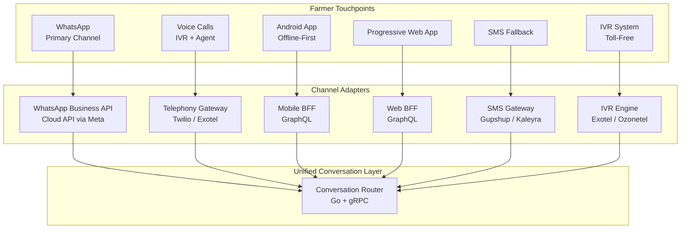
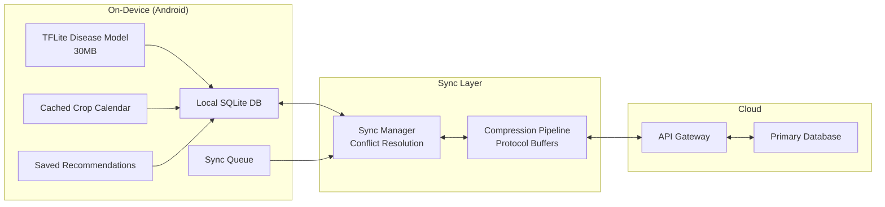
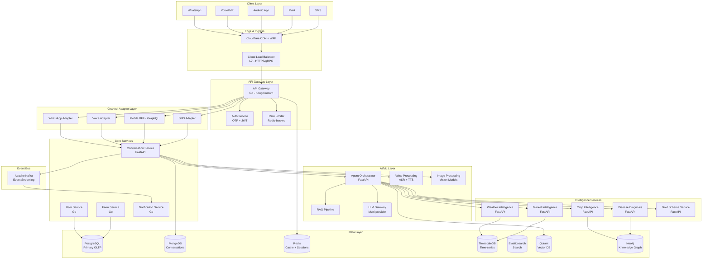
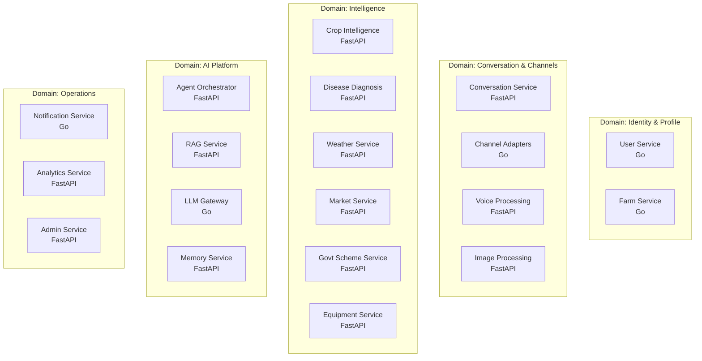
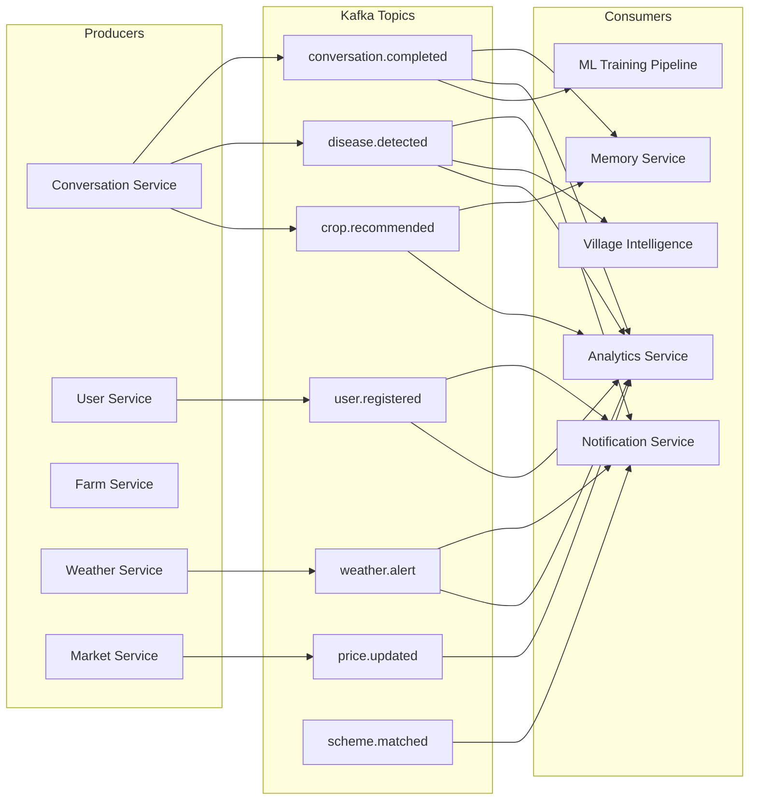
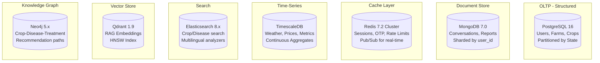
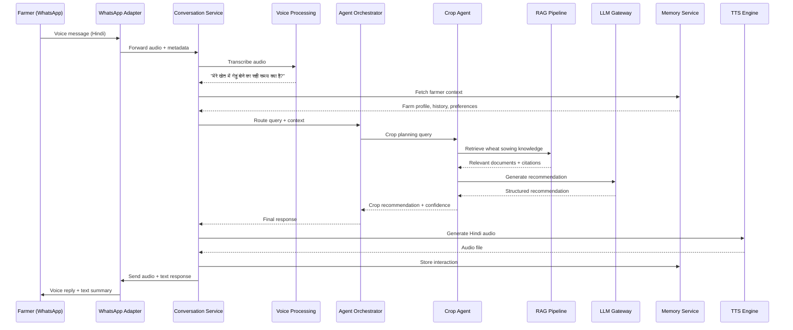

# Aranya.ai — Part 1: Vision & Core Platform Architecture

> **Document Classification**: Confidential — Founding Team & Investors Only  
> **Version**: 1.0 | **Date**: June 2026  
> **Authors**: CTO Office — Architecture & Engineering  

---

## 1. Executive Summary

**Aranya.ai** is India's agricultural decision intelligence infrastructure — a voice-first, multilingual platform that transforms how 100M+ farmers make critical farming decisions.

> [!IMPORTANT]
> This is NOT a chatbot. This is a **decision engine** that reduces costly farming mistakes and increases farmer confidence by combining farm-specific context, local intelligence, weather, crop science, market data, and government schemes into actionable, trusted recommendations.

### Core Philosophy

| What Farmers Want | What We Deliver | AI's Role |
|---|---|---|
| Better yields | Crop selection + timing recommendations | Predictive analytics |
| Lower risk | Weather alerts + disease early warning | Risk modeling |
| Better profits | Market timing + buyer matching | Demand forecasting |
| Faster diagnosis | Real-time disease identification | Computer vision + NLP |
| Trusted recommendations | Confidence scores + expert validation | Explainable AI |

### Scale Targets

| Metric | Year 1 | Year 2 | Year 3 | Year 5 |
|--------|--------|--------|--------|--------|
| Registered Farmers | 10K | 1M | 10M | 100M |
| Daily Active Users | 5K | 500K | 5M | 10M |
| Daily Interactions | 50K | 5M | 50M | 100M |
| Requests/Second (peak) | 10 | 1K | 10K | 100K |
| Languages Supported | 3 | 8 | 15 | 22 |
| Response Latency (p95) | < 3s | < 2s | < 1.5s | < 1s |

---

## 2. Product Architecture

### 2.1 Channel Strategy



### 2.2 Channel-Specific Design

| Channel | User Profile | Interaction Mode | Bandwidth | Offline? | Priority |
|---------|-------------|-----------------|-----------|----------|----------|
| **WhatsApp** | Smartphone farmers, 60%+ reach | Text + Voice + Image | Low-Medium | Messages queued | **P0** |
| **Voice Calls** | Feature phone, low-literacy | Voice-only, IVR menus | Minimal | N/A | **P0** |
| **Android App** | Smartphone, repeat users | Full UI, camera, GPS | Variable | Yes | **P1** |
| **SMS** | Feature phone, fallback | Text-only, 160 chars | Minimal | N/A | **P1** |
| **PWA** | Desktop/tablet, agents | Full UI, dashboard | Medium-High | Partial | **P2** |
| **IVR** | Toll-free, mass reach | DTMF + voice | Minimal | N/A | **P2** |

### 2.3 Voice-First Design Philosophy

> [!TIP]
> 40% of Indian farmers have limited literacy. Voice is not a feature — it is the primary interface.

**Design Principles:**
1. Every interaction must work with voice alone
2. Visual UI supplements voice, never replaces it
3. Language detection happens in < 500ms
4. Responses are concise (< 30 seconds spoken)
5. Critical information is repeated and confirmed
6. Numerical data (prices, dates) is spoken digit-by-digit

### 2.4 Multilingual Architecture

**Phase 1 (V1-V2):** Hindi, English, Marathi  
**Phase 2 (V3):** Tamil, Telugu, Kannada, Bengali, Gujarati, Punjabi, Malayalam  
**Phase 3 (V4):** Odia, Assamese, Bhojpuri, Rajasthani, Chhattisgarhi + all Scheduled Languages

**Translation Strategy:**
- Core prompts: Human-translated + expert-reviewed
- Dynamic content: LLM translation with quality scoring
- Agricultural terminology: Custom glossaries per language per region
- Phonetic variations: Dialect-aware ASR models

### 2.5 Offline-First Architecture



**Offline Capabilities:**
- Farm data entry and editing
- Crop calendar and seasonal reminders
- Basic disease identification (on-device ViT-Tiny, 30MB)
- Saved past recommendations
- Cached weather forecast (24-48 hours)
- Mandi prices (last sync)

**Sync Protocol:**
- Delta sync with vector clocks
- Conflict resolution: Last-Write-Wins for farm data, Merge for interactions
- Priority queue: Critical alerts first, then fresh data, then history
- Bandwidth-adaptive: Compress to Protocol Buffers on 2G, full JSON on 4G+

---

## 3. System Architecture Overview

### 3.1 High-Level Architecture



### 3.2 Design Principles

| Principle | Implementation | Rationale |
|-----------|---------------|-----------|
| **Event-Driven** | Kafka for all inter-service events | Decoupling, audit trail, replay |
| **CQRS** | Separate read/write models for farm data | 100:1 read/write ratio at scale |
| **Eventual Consistency** | Async updates via Kafka consumers | Availability > strong consistency for most flows |
| **Circuit Breaker** | Resilience4j / go-circuitbreaker | LLM APIs fail; system must not cascade |
| **Bulkhead** | Isolated thread pools per downstream | Disease diagnosis failure ≠ weather failure |
| **Strangler Fig** | Incremental migration from monolith | V1 starts simple, evolves to microservices |

> [!WARNING]
> **V1 is NOT microservices.** V1 is a modular monolith (FastAPI + Go) with clear module boundaries. Premature decomposition kills startups. Extract services only when scale or team boundaries demand it (V2+).

### 3.3 API Gateway Design

```mermaid
flowchart LR
    REQ[Incoming Request] --> TLS[TLS Termination]
    TLS --> RL[Rate Limiting<br/>100 req/min/user]
    RL --> AUTH[Authentication<br/>JWT Validation]
    AUTH --> ROUTE[Route Matching<br/>Path + Version]
    ROUTE --> TRANSFORM[Request Transform<br/>Header injection]
    TRANSFORM --> LB2[Service Load Balance<br/>Round-robin + health]
    LB2 --> SVC[Target Service]
    SVC --> RESP[Response Transform]
    RESP --> LOG[Audit Logging<br/>Kafka]
    LOG --> CLIENT[Client Response]
```



**Technology Choice**: Custom Go gateway wrapping Kong's plugin architecture
- **Why Go**: 10x lower latency vs Node.js/Python at gateway layer, < 1ms overhead
- **Why not pure Kong**: Need custom auth flow (OTP + JWT + device fingerprint), custom rate limiting per farmer tier

---

## 4. Backend Architecture

### 4.1 Service Decomposition



### 4.2 Service Details

#### User Service (Go)

| Aspect | Detail |
|--------|--------|
| **Responsibility** | Registration, authentication, profile management, preferences |
| **APIs** | gRPC internal, REST for admin |
| **Data Store** | PostgreSQL (users, profiles), Redis (sessions, OTP) |
| **Scale** | 100M records, 10K RPS reads, 100 RPS writes |
| **Key Endpoints** | `RegisterWithOTP`, `VerifyOTP`, `GetProfile`, `UpdatePreferences`, `DeleteAccount` |

**Schema: `users` table**
```sql
CREATE TABLE users (
    id              UUID PRIMARY KEY DEFAULT gen_random_uuid(),
    phone_hash      VARCHAR(64) NOT NULL UNIQUE,  -- SHA-256 of phone
    phone_encrypted BYTEA NOT NULL,                -- AES-256 encrypted phone
    name            VARCHAR(100),
    language_pref   VARCHAR(10) DEFAULT 'hi',
    state_code      VARCHAR(5) NOT NULL,
    district_code   VARCHAR(10),
    village_id      UUID REFERENCES villages(id),
    onboarding_complete BOOLEAN DEFAULT FALSE,
    consent_data    JSONB NOT NULL DEFAULT '{}',
    created_at      TIMESTAMPTZ DEFAULT NOW(),
    updated_at      TIMESTAMPTZ DEFAULT NOW(),
    deleted_at      TIMESTAMPTZ  -- soft delete for DPDPA compliance
) PARTITION BY LIST (state_code);

CREATE INDEX idx_users_phone ON users (phone_hash);
CREATE INDEX idx_users_village ON users (village_id);
CREATE INDEX idx_users_state ON users (state_code, district_code);
```

#### Farm Service (Go)

| Aspect | Detail |
|--------|--------|
| **Responsibility** | Farm profiles, land records, crop history, soil data |
| **APIs** | gRPC internal |
| **Data Store** | PostgreSQL (structured farm data), MongoDB (unstructured observations) |
| **Scale** | 200M farm records (multiple plots per farmer) |

**Schema: `farms` table**
```sql
CREATE TABLE farms (
    id              UUID PRIMARY KEY DEFAULT gen_random_uuid(),
    user_id         UUID NOT NULL REFERENCES users(id),
    name            VARCHAR(100),
    location        GEOGRAPHY(POINT, 4326),
    area_acres      DECIMAL(10,2),
    soil_type       VARCHAR(50),  -- clay, loam, sandy, etc.
    irrigation_type VARCHAR(50),  -- rainfed, borewell, canal, drip
    water_source    VARCHAR(50),
    soil_ph         DECIMAL(3,1),
    soil_nitrogen   DECIMAL(5,2),  -- kg/ha
    soil_phosphorus DECIMAL(5,2),
    soil_potassium  DECIMAL(5,2),
    last_soil_test  DATE,
    state_code      VARCHAR(5) NOT NULL,
    created_at      TIMESTAMPTZ DEFAULT NOW(),
    updated_at      TIMESTAMPTZ DEFAULT NOW()
) PARTITION BY LIST (state_code);

CREATE TABLE crop_history (
    id              UUID PRIMARY KEY DEFAULT gen_random_uuid(),
    farm_id         UUID NOT NULL REFERENCES farms(id),
    crop_code       VARCHAR(20) NOT NULL,
    season          VARCHAR(10) NOT NULL,  -- kharif, rabi, zaid
    year            INT NOT NULL,
    sowing_date     DATE,
    harvest_date    DATE,
    yield_quintal   DECIMAL(10,2),
    revenue_inr     DECIMAL(12,2),
    cost_inr        DECIMAL(12,2),
    issues          TEXT[],
    rating          SMALLINT CHECK (rating BETWEEN 1 AND 5),
    created_at      TIMESTAMPTZ DEFAULT NOW()
);

CREATE INDEX idx_crop_history_farm ON crop_history (farm_id, year, season);
```

#### Conversation Service (FastAPI)

| Aspect | Detail |
|--------|--------|
| **Responsibility** | Conversation state, message routing, context management |
| **APIs** | gRPC internal, WebSocket for real-time |
| **Data Store** | MongoDB (conversations), Redis (active sessions) |
| **Scale** | 100M conversations/month, 1K concurrent sessions |

**Schema: MongoDB `conversations` collection**
```json
{
    "_id": "ObjectId",
    "user_id": "UUID",
    "channel": "whatsapp|voice|app|sms|ivr",
    "language": "hi",
    "status": "active|completed|escalated",
    "messages": [
        {
            "id": "UUID",
            "role": "user|assistant|system",
            "content": "text content",
            "content_type": "text|voice|image|location",
            "media_url": "gs://...",
            "timestamp": "ISO8601",
            "agent_used": "crop|disease|weather|market|govt",
            "confidence": 0.87,
            "tokens_used": 450,
            "latency_ms": 1200
        }
    ],
    "context": {
        "farm_id": "UUID",
        "current_crop": "wheat",
        "current_season": "rabi",
        "active_issues": ["pest_attack"],
        "memory_refs": ["mem_id_1", "mem_id_2"]
    },
    "metadata": {
        "total_messages": 12,
        "total_tokens": 5400,
        "total_cost_usd": 0.023,
        "satisfaction_score": 4
    },
    "created_at": "ISO8601",
    "updated_at": "ISO8601"
}
```

#### Crop Intelligence Service (FastAPI)

| Aspect | Detail |
|--------|--------|
| **Responsibility** | Crop recommendations, profit estimation, rotation planning |
| **APIs** | gRPC internal |
| **Data Store** | PostgreSQL (crop master data), Neo4j (crop relationships), Qdrant (embeddings) |
| **Scale** | 50K inferences/day → 5M/day |

**Key Outputs:**
```json
{
    "recommendations": [
        {
            "crop": "Wheat (HD-2967)",
            "confidence": 0.89,
            "profit_estimate_inr": 45000,
            "profit_range": [38000, 52000],
            "risk_score": 0.3,
            "risk_factors": ["moderate_rainfall_risk", "pest_low"],
            "sowing_window": "2026-11-01 to 2026-11-20",
            "expected_yield_quintal": 22.5,
            "water_requirement_mm": 450,
            "market_demand": "high",
            "nearby_buyers": 5,
            "reasoning": "Based on your soil type (loam, pH 7.2), irrigation (borewell), last year's successful wheat crop, and current rabi season timing..."
        }
    ],
    "metadata": {
        "data_sources": ["ICAR", "local_kvk", "historical_yields"],
        "last_updated": "2026-06-10T12:00:00Z"
    }
}
```

#### Disease Diagnosis Service (FastAPI)

| Aspect | Detail |
|--------|--------|
| **Responsibility** | Image-based disease detection, symptom analysis, treatment recommendation |
| **APIs** | gRPC internal |
| **Data Store** | PostgreSQL (disease DB), GCS (images), Neo4j (disease-treatment graph) |
| **Scale** | 10K images/day → 1M/day |
| **Models** | ViT-B/16 (fine-tuned), EfficientNet-V2, custom crop-specific CNNs |

#### Weather Intelligence Service (FastAPI)

| Aspect | Detail |
|--------|--------|
| **Responsibility** | Forecast integration, alerts, actionable recommendations |
| **Data Sources** | IMD, Open-Meteo, Tomorrow.io, ISRO satellite |
| **Data Store** | TimescaleDB (historical + forecast), Redis (current conditions) |
| **Scale** | 640K villages × 8 updates/day = 5M writes/day |

#### Market Intelligence Service (FastAPI)

| Aspect | Detail |
|--------|--------|
| **Responsibility** | Mandi prices, trends, demand forecasting, buyer matching |
| **Data Sources** | eNAM API, AgMarkNet, state mandi boards |
| **Data Store** | TimescaleDB (price history), PostgreSQL (buyer network) |
| **Scale** | 7K mandis × 100 commodities × 24 updates = 17M data points/day |

#### Government Scheme Service (FastAPI)

| Aspect | Detail |
|--------|--------|
| **Responsibility** | Scheme discovery, eligibility checking, application guidance |
| **Data Sources** | PM-KISAN, PMFBY, state schemes, KCC, subsidies |
| **Data Store** | PostgreSQL (scheme metadata), Qdrant (RAG for scheme details) |
| **Scale** | 500+ schemes across center + states, updated weekly |

### 4.3 Technology Stack Justification

| Component | Technology | Why This | Why Not Alternative |
|-----------|-----------|----------|-------------------|
| **AI Services** | FastAPI (Python 3.12) | PyTorch/TensorFlow ecosystem, async, type hints | Go lacks ML ecosystem; Flask lacks async |
| **High-throughput** | Go 1.22 | Compiled, goroutines, < 2ms p99, tiny memory | Java too heavy; Rust too slow to develop |
| **Inter-service** | gRPC + Protobuf | Type safety, codegen, 10x smaller than JSON | REST overhead; GraphQL too complex internally |
| **Client API** | GraphQL (gqlgen - Go) | Client-driven queries, reduce over-fetching for mobile | REST requires multiple roundtrips on slow networks |
| **External** | REST + OpenAPI 3.1 | Universal compatibility for govt/partner integrations | gRPC not supported by most govt systems |
| **Event Bus** | Apache Kafka 3.7 | Exactly-once, durable, 100K msg/s per partition | RabbitMQ lacks durability; Pulsar less mature |
| **Task Queue** | Celery + Redis | Python ecosystem, for async ML tasks | Kafka overkill for one-off tasks |

### 4.4 Event-Driven Architecture



---

## 5. Database Architecture

### 5.1 Polyglot Persistence Strategy



### 5.2 Database Selection Rationale

| Database | Use Case | Data Volume (Year 3) | Access Pattern | Why This DB |
|----------|----------|---------------------|----------------|-------------|
| **PostgreSQL 16** | Users, farms, schemes | 500GB | CRUD, complex joins, partitioned | ACID, partitioning, mature, extensions |
| **MongoDB 7.0** | Conversations, disease reports | 5TB | Append-heavy, flexible schema | Schema flexibility, horizontal sharding |
| **Redis 7.2** | Cache, sessions, rate limits | 50GB | Sub-ms reads, 100K ops/s | In-memory speed, Cluster mode, Pub/Sub |
| **TimescaleDB** | Weather, prices, metrics | 2TB | Time-range queries, aggregations | PostgreSQL compatible, continuous aggs |
| **Elasticsearch** | Full-text search, multilingual | 200GB | Search, autocomplete, facets | Multilingual analyzers, fuzzy search |
| **Qdrant** | RAG embeddings, similarity search | 100GB (50M vectors) | ANN search, filtered search | Rust-based perf, payload filtering |
| **Neo4j** | Crop-disease-treatment graph | 10GB | Graph traversal, path queries | Native graph, Cypher query language |

### 5.3 Partitioning & Sharding Strategy

**PostgreSQL Partitioning:**
```sql
-- Partition users by state (28 states + 8 UTs = 36 partitions)
CREATE TABLE users_mh PARTITION OF users FOR VALUES IN ('MH');
CREATE TABLE users_up PARTITION OF users FOR VALUES IN ('UP');
CREATE TABLE users_mp PARTITION OF users FOR VALUES IN ('MP');
-- ... etc for all states

-- At 100M users: ~2.8M per partition (manageable)
-- Sub-partition by district if needed at V4
```

**MongoDB Sharding:**
```javascript
// Shard conversations by user_id (hash-based)
sh.shardCollection("aranya.conversations", { "user_id": "hashed" })

// Compound shard key for time-range queries
sh.shardCollection("aranya.weather_data", { "state_code": 1, "timestamp": 1 })
```

### 5.4 Read Scaling Strategy

```
Write Path:  Client → API GW → Service → Primary DB → Kafka (CDC)
Read Path:   Client → API GW → Service → Redis Cache → Read Replica → Primary DB

Cache Hit Ratio Target: 85% for frequently accessed data
```

**Caching Hierarchy:**
1. **L1 — In-process**: Go `sync.Map` / Python `lru_cache` (50ms TTL, hot keys)
2. **L2 — Redis Cluster**: Serialized responses (5-60min TTL, 50GB)
3. **L3 — CDN**: Static content, crop images, scheme PDFs (24h TTL)

### 5.5 Knowledge Graph Schema (Neo4j)

```cypher
// Core nodes
CREATE (c:Crop {code: 'wheat_hd2967', name: 'Wheat HD-2967', type: 'cereal', season: 'rabi'})
CREATE (d:Disease {code: 'rust_yellow', name: 'Yellow Rust', severity: 'high'})
CREATE (t:Treatment {code: 'propiconazole_25ec', name: 'Propiconazole 25% EC', type: 'fungicide'})
CREATE (s:Symptom {code: 'yellow_pustules', description: 'Yellow-orange pustules on leaves'})
CREATE (r:Region {code: 'MH_PUNE', name: 'Pune, Maharashtra'})
CREATE (so:Soil {type: 'black_cotton', ph_range: '7.5-8.5'})

// Relationships
CREATE (c)-[:SUSCEPTIBLE_TO {risk_level: 0.7}]->(d)
CREATE (d)-[:SHOWS_SYMPTOM {frequency: 0.9}]->(s)
CREATE (d)-[:TREATED_BY {efficacy: 0.85, application: '1ml/L foliar spray'}]->(t)
CREATE (c)-[:GROWS_WELL_IN]->(so)
CREATE (c)-[:RECOMMENDED_FOR {confidence: 0.82}]->(r)
CREATE (c)-[:FOLLOWS_CROP {benefit: 'nitrogen_fixation'}]->(c2:Crop {code: 'soybean'})
```

---

## 6. Service Interaction Patterns

### 6.1 End-to-End Query Flow (WhatsApp Voice Message)



### 6.2 Latency Budget

| Step | Target | Technique |
|------|--------|-----------|
| Audio upload | 200ms | Opus compression, chunked upload |
| ASR transcription | 300ms | Whisper Large V3 on GPU, streaming |
| Memory retrieval | 50ms | Redis + pre-computed embeddings |
| Agent routing | 10ms | Rule-based classifier |
| RAG retrieval | 100ms | Qdrant HNSW + BM25 parallel |
| LLM inference | 800ms | Streaming, cached frequent queries |
| TTS generation | 200ms | Pre-cached common phrases |
| Audio delivery | 150ms | CDN + edge caching |
| **Total** | **< 1.8s** | |

---

## 7. API Design

### 7.1 GraphQL Schema (Client-Facing)

```graphql
type Query {
    me: User!
    myFarms: [Farm!]!
    farm(id: ID!): Farm
    cropRecommendations(farmId: ID!, season: Season!): CropRecommendation!
    diagnoseDisease(imageUrl: String!, cropCode: String): DiagnosisResult!
    weather(farmId: ID!, days: Int = 7): WeatherForecast!
    mandiPrices(cropCode: String!, districtCode: String!): [MandiPrice!]!
    schemes(filters: SchemeFilter): [GovernmentScheme!]!
    conversationHistory(limit: Int = 20, cursor: String): ConversationConnection!
}

type Mutation {
    sendMessage(input: MessageInput!): MessageResponse!
    registerFarm(input: FarmInput!): Farm!
    updateFarm(id: ID!, input: FarmInput!): Farm!
    recordCropHistory(input: CropHistoryInput!): CropHistory!
    requestCallback: CallbackRequest!
    deleteMyData: DeletionConfirmation!  # DPDPA compliance
}

type Subscription {
    newMessage(conversationId: ID!): Message!
    weatherAlert(farmId: ID!): WeatherAlert!
    priceAlert(cropCode: String!): PriceAlert!
}
```

### 7.2 gRPC Service Definitions (Internal)

```protobuf
syntax = "proto3";
package aranya.conversation.v1;

service ConversationService {
    rpc ProcessMessage(ProcessMessageRequest) returns (ProcessMessageResponse);
    rpc StreamResponse(ProcessMessageRequest) returns (stream ResponseChunk);
    rpc GetHistory(GetHistoryRequest) returns (GetHistoryResponse);
}

message ProcessMessageRequest {
    string user_id = 1;
    string conversation_id = 2;
    string channel = 3;
    oneof content {
        string text = 4;
        bytes audio = 5;
        string image_url = 6;
        Location location = 7;
    }
    string language = 8;
    map<string, string> metadata = 9;
}

message ProcessMessageResponse {
    string message_id = 1;
    string text_response = 2;
    optional bytes audio_response = 3;
    string agent_used = 4;
    float confidence = 5;
    repeated Citation citations = 6;
    int32 latency_ms = 7;
}
```

---

> [!NOTE]
> **Next**: See [Part 2 — AI & ML Architecture](./02-ai-and-ml-architecture.md) for the complete AI stack including Foundation Models, RAG, Agent Architecture, Voice Pipeline, and Disease Diagnosis Pipeline.
