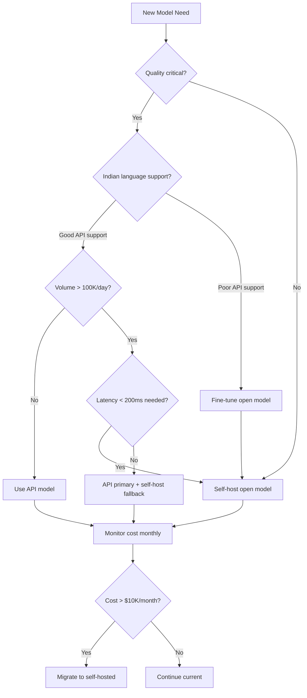
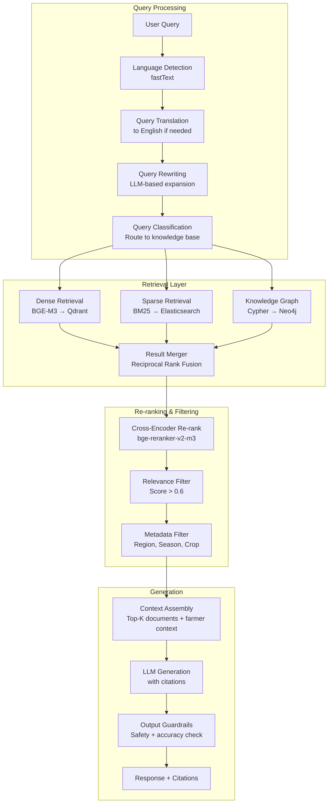
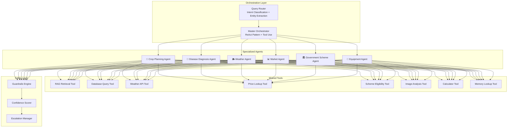
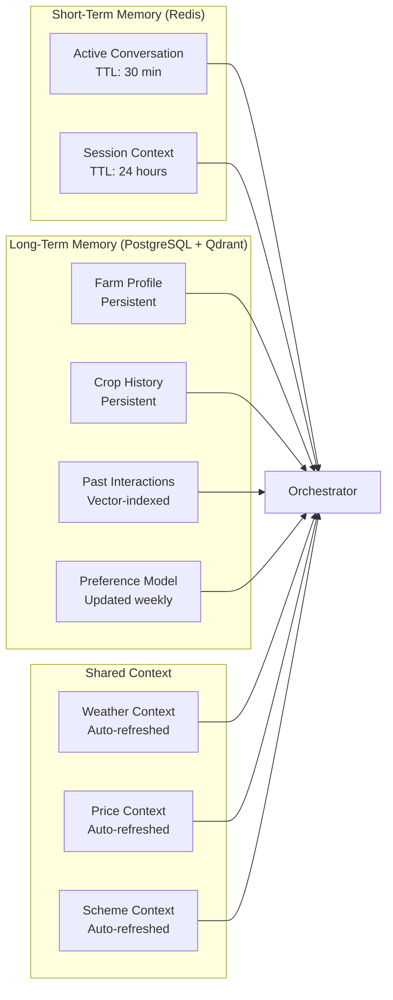
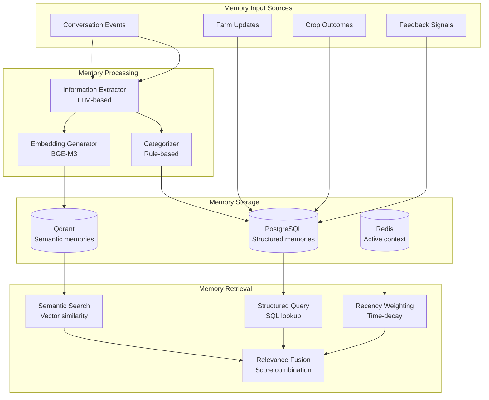
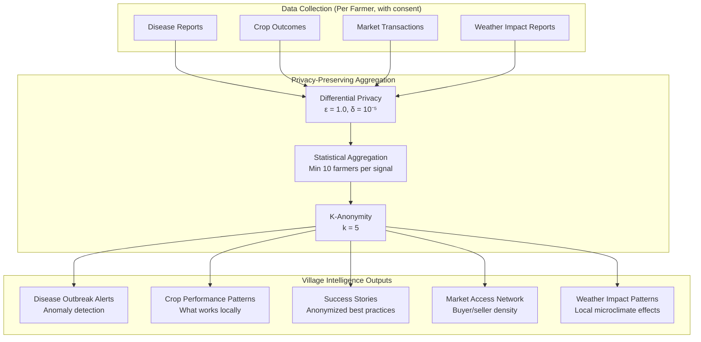
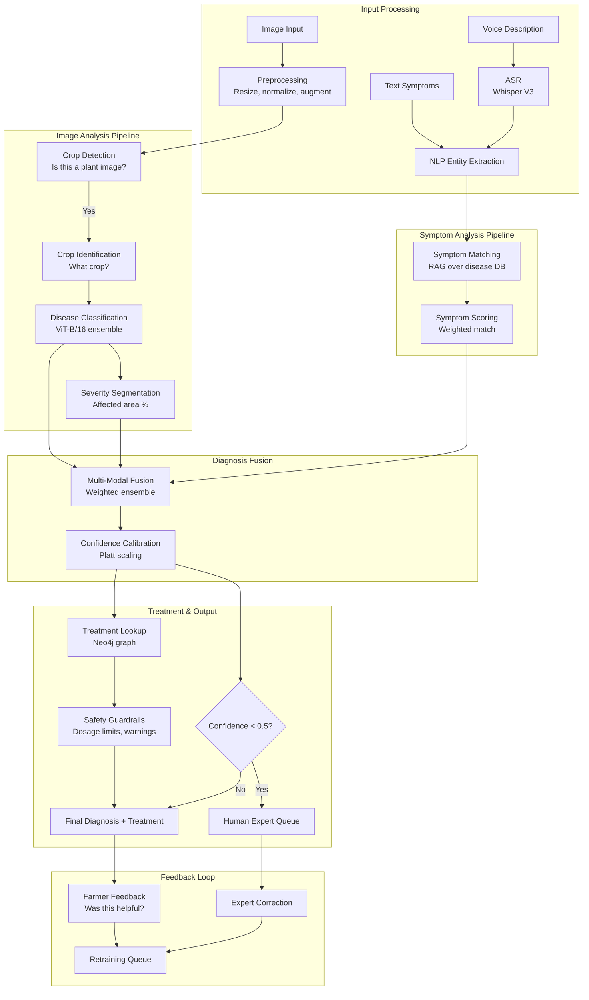
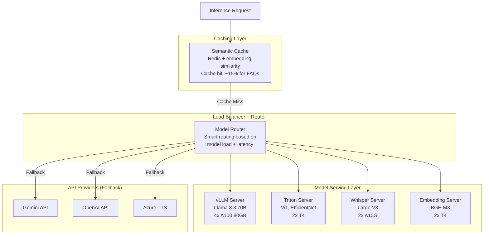

# Aranya.ai — Part 2: AI & Machine Learning Architecture

> **Document Classification**: Confidential — Founding Team & Investors Only  
> **Version**: 1.0 | **Date**: June 2026  

---

## 1. Foundation Model Strategy

### 1.1 Model Selection Matrix

| Use Case | Primary Model | Fallback Model | Hosting | Est. Latency | Est. Cost (1M calls) |
|----------|--------------|----------------|---------|-------------|---------------------|
| **Conversational AI** | Gemini 2.5 Flash | Llama 3.3 70B (GPTQ) | API → Self-hosted at V3 | 600-1200ms | $15 API / $8 self-hosted |
| **Complex Reasoning** | GPT-4o | Gemini 2.5 Pro | API only | 1000-2000ms | $45 |
| **Voice ASR (Indian)** | Whisper Large V3 | IndicWhisper (AI4Bharat) | Self-hosted (GPU) | 200-400ms | $2 (GPU amortized) |
| **Voice TTS** | Azure Neural TTS (Indian) | Coqui XTTS v2 | API → Self-hosted | 150-300ms | $10 API / $3 self |
| **Disease Detection** | Fine-tuned ViT-B/16 | EfficientNet-V2-S | Self-hosted | 50-100ms | $0.50 (GPU amortized) |
| **Image Classification** | CLIP ViT-L/14 | SigLIP | Self-hosted | 80-150ms | $0.80 |
| **Embeddings** | BGE-M3 (multilingual) | multilingual-e5-large | Self-hosted | 10-30ms | $0.20 |
| **Re-ranking** | bge-reranker-v2-m3 | ms-marco-MiniLM | Self-hosted | 20-50ms | $0.30 |
| **Translation** | IndicTrans2 (AI4Bharat) | NLLB-200-3.3B | Self-hosted | 100-200ms | $1.00 |
| **Language Detection** | fastText lid.176 | Custom CNN | Self-hosted (CPU) | 5ms | Negligible |
| **Sentiment Analysis** | Fine-tuned XLM-R | IndicBERT | Self-hosted (CPU) | 15ms | Negligible |

### 1.2 API vs Self-Hosted Decision Framework



> [!IMPORTANT]
> **Cost Crossover Analysis**: At ~50K daily LLM calls, API costs exceed self-hosted GPU inference costs. Plan self-hosting migration at V2 (10K users) for primary conversation model. Keep API as fallback.

### 1.3 Cost Per 1M Tokens Comparison

| Provider | Input (1M tokens) | Output (1M tokens) | Indian Language Quality | Latency (p50) |
|----------|-------------------|--------------------|-----------------------|---------------|
| **GPT-4o** | $2.50 | $10.00 | Good (Hindi, Tamil) | 800ms |
| **GPT-4o-mini** | $0.15 | $0.60 | Moderate | 400ms |
| **Gemini 2.5 Flash** | $0.15 | $0.60 | Very Good (all Indian) | 350ms |
| **Gemini 2.5 Pro** | $1.25 | $5.00 | Excellent | 700ms |
| **Claude 4 Sonnet** | $3.00 | $15.00 | Moderate | 600ms |
| **Llama 3.3 70B (self)** | ~$0.40 | ~$0.40 | Good (fine-tuned) | 500ms |
| **Llama 3.3 8B (self)** | ~$0.05 | ~$0.05 | Moderate (fine-tuned) | 100ms |
| **Mistral Large 2** | $2.00 | $6.00 | Poor | 500ms |

> [!TIP]
> **Recommended Strategy**: Gemini 2.5 Flash as primary (best Indian language support, competitive pricing), GPT-4o for complex reasoning fallback, Llama 3.3 70B self-hosted at scale. Use Llama 3.3 8B for simple, high-volume queries (FAQ, weather summaries).

### 1.4 Fine-Tuning Strategy

**Phase 1: Prompt Engineering + Few-Shot (V1)**
- Curate 500+ expert Q&A pairs per domain
- Build domain-specific system prompts
- Use structured output (JSON mode) for reliable parsing

**Phase 2: Fine-Tune Open Models (V2)**
- Fine-tune Llama 3.3 8B on 50K agricultural conversations
- Fine-tune IndicWhisper on farmer voice samples
- Fine-tune ViT-B/16 on 200K Indian crop disease images
- Dataset: Human-validated interactions from V1 + expert annotations

**Phase 3: Domain-Specific Models (V3+)**
- Train specialized crop recommendation model
- Train regional dialect ASR models
- Build custom embedding model for agricultural terminology
- Continuous learning from farmer feedback

---

## 2. RAG Architecture

### 2.1 RAG Pipeline Overview



### 2.2 Embedding Strategy

**Model**: BGE-M3 (BAAI/bge-m3)
- 1024 dimensions
- Supports 100+ languages (excellent Hindi, Tamil, Telugu)
- Hybrid dense + sparse representations
- Max sequence length: 8192 tokens

**Why BGE-M3 over alternatives:**

| Model | Dimensions | Multilingual | Indian Lang Quality | Speed | Decision |
|-------|-----------|-------------|--------------------|----|---------|
| **BGE-M3** | 1024 | 100+ | ★★★★★ | Fast | ✅ Primary |
| multilingual-e5-large | 1024 | 100+ | ★★★★☆ | Fast | Fallback |
| Cohere multilingual-v3 | 1024 | 100+ | ★★★★☆ | API | Too expensive at scale |
| OpenAI text-3-large | 3072 | 50+ | ★★★☆☆ | API | Weak Indian languages |
| IndicBERT | 768 | 12 Indian | ★★★★★ | Fast | Limited to Indian only |

### 2.3 Chunking Strategy

```python
# Agricultural knowledge chunking strategy
class AgriculturalChunker:
    """
    Domain-aware chunking that respects:
    1. Section boundaries in research papers
    2. Crop-specific information blocks
    3. Treatment/recommendation sequences
    4. Regional variation sections
    """
    
    CHUNK_SIZES = {
        "crop_guide": 512,      # Concise, factual
        "disease_guide": 768,   # Need symptom + treatment together
        "scheme_document": 1024, # Complex eligibility criteria
        "research_paper": 512,  # Abstract, methods, results separately
        "weather_advisory": 256, # Short, actionable
        "market_report": 512,   # Prices + analysis together
    }
    
    OVERLAP = 64  # tokens overlap between chunks
    
    METADATA_FIELDS = [
        "source_type",      # icar, kvk, government, research
        "crop_codes",       # [wheat, rice, cotton]
        "region_codes",     # [MH, UP, MP]
        "season",           # kharif, rabi, zaid
        "language",         # original language
        "last_updated",     # freshness signal
        "confidence_level", # expert_reviewed, auto_extracted
    ]
```

### 2.4 Knowledge Base Architecture

| Knowledge Base | Source | Documents | Update Frequency | Priority |
|----------------|--------|-----------|-----------------|----------|
| **Crop Encyclopedia** | ICAR, state agriculture depts | 50K articles | Monthly | P0 |
| **Disease Database** | PlantVillage, CABI, custom | 30K entries | Weekly | P0 |
| **Treatment Guide** | KVK advisories, ICAR | 20K protocols | Monthly | P0 |
| **Government Schemes** | Ministry of Agriculture, states | 2K schemes | Weekly | P0 |
| **Weather Advisories** | IMD, state met depts | Rolling 5K | Daily | P0 |
| **Market Intelligence** | eNAM, mandi boards | Rolling 100K | Hourly | P1 |
| **Research Papers** | Agricultural universities | 100K papers | Monthly | P2 |
| **Success Stories** | Field data, farmer interviews | 10K stories | Weekly | P2 |
| **Equipment Guides** | Manufacturer data, reviews | 5K guides | Quarterly | P3 |

### 2.5 Vector Database Architecture (Qdrant)

```json
{
    "collections": {
        "crop_knowledge": {
            "vector_size": 1024,
            "distance": "Cosine",
            "on_disk": true,
            "hnsw_config": {
                "m": 16,
                "ef_construct": 128,
                "full_scan_threshold": 10000
            },
            "payload_index": [
                {"field": "crop_codes", "type": "keyword"},
                {"field": "region_codes", "type": "keyword"},
                {"field": "season", "type": "keyword"},
                {"field": "source_type", "type": "keyword"},
                {"field": "language", "type": "keyword"},
                {"field": "last_updated", "type": "datetime"}
            ]
        },
        "disease_knowledge": { "...similar config..." },
        "scheme_knowledge": { "...similar config..." },
        "farmer_memories": { "...similar config, per-user partitioned..." }
    }
}
```

**Estimated Vector Counts (Year 3):**
- Crop knowledge: 5M vectors
- Disease knowledge: 3M vectors
- Scheme knowledge: 500K vectors
- Market reports: 10M vectors
- Farmer memories: 50M vectors (0.5M farmers × 100 memories avg)
- **Total: ~70M vectors, ~280GB storage**

### 2.6 Retrieval Quality Metrics

| Metric | Target | Measurement |
|--------|--------|-------------|
| Recall@10 | > 0.85 | % of relevant docs in top 10 |
| MRR (Mean Reciprocal Rank) | > 0.70 | Position of first relevant result |
| Answer accuracy | > 0.80 | Human evaluation on sample |
| Hallucination rate | < 5% | Factual verification audit |
| Citation accuracy | > 0.90 | Source verification |

---

## 3. Agent Architecture

### 3.1 Agent System Overview



### 3.2 Query Router

```python
class QueryRouter:
    """
    Classifies incoming queries to the appropriate agent(s).
    Uses lightweight fine-tuned model for < 50ms routing.
    """
    
    INTENT_MAP = {
        "crop_planning": ["CropAgent"],
        "crop_recommendation": ["CropAgent", "MarketAgent"],
        "disease_diagnosis": ["DiseaseAgent"],
        "disease_treatment": ["DiseaseAgent"],
        "weather_query": ["WeatherAgent"],
        "weather_action": ["WeatherAgent", "CropAgent"],
        "price_query": ["MarketAgent"],
        "sell_timing": ["MarketAgent"],
        "scheme_query": ["GovernmentSchemeAgent"],
        "scheme_apply": ["GovernmentSchemeAgent"],
        "equipment_query": ["EquipmentAgent"],
        "general_farming": ["CropAgent"],  # default
        "greeting": None,  # handle directly
        "unknown": ["CropAgent"],  # default fallback
    }
    
    # Multi-agent queries: "What should I plant and what schemes are available?"
    # → Routes to both CropAgent AND GovernmentSchemeAgent in parallel
```

### 3.3 Agent Specifications

#### 🌾 Crop Planning Agent

```yaml
name: CropPlanningAgent
description: Recommends crops based on farm conditions, market, and weather

inputs:
  - farm_profile: {soil, water, area, location, equipment}
  - crop_history: [{crop, season, year, yield, issues}]
  - weather_forecast: {temperature, rainfall, humidity, 30_day}
  - market_prices: {current_prices, 90_day_trend, demand_signal}
  - farmer_preferences: {risk_appetite, labor_availability, budget}

outputs:
  - recommendations: 
      - crop: string
      - variety: string  
      - confidence: float (0-1)
      - profit_estimate: {min, expected, max} INR
      - risk_score: float (0-1)
      - risk_factors: string[]
      - water_requirement: string
      - sowing_window: {start, end}
      - harvest_estimate: date
      - market_demand: high|medium|low
      - nearby_buyers: int
      - reasoning: string  # explainability
  - citations: [{source, url, relevance}]
  - confidence_level: high|medium|low
  - suggest_expert_review: boolean

tools:
  - rag_retrieval: Query crop knowledge base
  - weather_api: Get location-specific forecast
  - price_lookup: Current mandi prices and trends
  - soil_compatibility: Check crop-soil suitability (Neo4j)
  - rotation_checker: Verify crop rotation benefits (Neo4j)
  - profit_calculator: Estimate revenue - costs
  - memory_lookup: Past crop performance for this farmer

guardrails:
  - Never recommend a crop that is water-incompatible with irrigation type
  - Always show confidence score and risk factors
  - Flag if recommendation contradicts local KVK advisory
  - Require expert review if confidence < 0.6
  - Include at least 2 alternative crops
```

#### 🔬 Disease Diagnosis Agent

```yaml
name: DiseaseDiagnosisAgent
description: Identifies crop diseases from images, symptoms, or voice descriptions

inputs:
  - image: bytes (optional, up to 3 images)
  - symptoms_text: string (optional)
  - symptoms_voice: bytes (optional, transcribed by ASR)
  - crop_code: string
  - farm_location: {lat, lon}
  - growth_stage: string

outputs:
  - diagnoses:
      - disease: string
      - confidence: float (0-1)
      - severity: low|medium|high|critical
      - affected_area_pct: float  # from image analysis
      - symptoms_matched: string[]
  - treatments:
      - action: string
      - product: string
      - dosage: string
      - application_method: string
      - cost_estimate: float INR
      - organic_alternative: string (optional)
  - prevention_tips: string[]
  - escalation:
      - needed: boolean
      - reason: string  # "confidence < 0.5" or "critical severity"
      - nearest_kvk: {name, phone, distance_km}
  - village_alert:
      - trigger: boolean  # if outbreak pattern detected
      - disease: string
      - affected_farms_nearby: int

tools:
  - image_classifier: ViT-B/16 crop disease model
  - symptom_matcher: RAG over disease symptom database
  - treatment_lookup: Neo4j disease-treatment graph
  - outbreak_checker: Village-level disease aggregation
  - expert_connect: Route to agronomist if needed

guardrails:
  - NEVER recommend pesticide dosage above manufacturer maximum
  - ALWAYS show confidence score for diagnosis
  - If confidence < 0.5, automatically escalate to human expert
  - If disease is notifiable (locust, etc.), alert authorities
  - Recommend organic alternatives when available
  - Include safety warnings for chemical treatments
```

#### 🌦️ Weather Agent

```yaml
name: WeatherAgent
description: Interprets weather data into farming action recommendations

inputs:
  - location: {lat, lon}
  - farm_id: UUID
  - current_crop: string
  - growth_stage: string
  - query_context: string

outputs:
  - forecast_summary: string (farmer-friendly language)
  - alerts:
      - type: heatwave|frost|heavy_rain|drought|cyclone|hail
      - severity: low|medium|high|critical
      - start_time: datetime
      - duration_hours: int
      - probability: float
  - recommendations:
      - action: string  # "Irrigate today", "Delay spraying by 2 days"
      - urgency: immediate|today|this_week
      - reasoning: string
  - sowing_window:
      - is_optimal: boolean
      - optimal_dates: {start, end}
      - reasoning: string

tools:
  - weather_api: IMD + Open-Meteo + Tomorrow.io
  - crop_weather_rules: Climate requirements per crop per stage
  - historical_weather: Compare with 10-year averages
  - alert_generator: Generate actionable alerts
```

#### 📊 Market Agent

```yaml
name: MarketAgent
description: Market prices, trends, timing, and buyer discovery

inputs:
  - crop_code: string
  - location: {lat, lon, district_code}
  - quantity_quintal: float (optional)
  - quality_grade: string (optional)
  - desired_timeline: string (optional)

outputs:
  - current_prices:
      - mandi_name: string
      - distance_km: float
      - modal_price: float INR/quintal
      - min_price: float
      - max_price: float
      - arrival_quantity: float quintal
      - last_updated: datetime
  - trend_analysis:
      - direction: up|down|stable
      - change_7d_pct: float
      - change_30d_pct: float
      - seasonal_pattern: string
      - forecast_next_15d: {min, expected, max}
  - sell_recommendation:
      - timing: sell_now|wait_N_days|hold
      - reasoning: string
      - confidence: float
      - optimal_mandi: string
  - buyers:
      - name: string
      - type: mandi_trader|processor|exporter|fpo
      - contact: string
      - typical_premium: float pct

tools:
  - enam_api: Real-time eNAM mandi prices
  - agmarknet_scraper: AgMarkNet price data
  - price_predictor: ML model for 15-day price forecast
  - buyer_network: PostgreSQL buyer database
  - transport_cost: Estimate transport to each mandi
```

#### 🏛️ Government Scheme Agent

```yaml
name: GovernmentSchemeAgent
description: Discover, check eligibility, and guide applications for govt schemes

inputs:
  - farmer_profile: {land_size, category, state, income, crops, bank_details}
  - query_type: discover|check_eligibility|apply_guidance|status_check
  - scheme_name: string (optional)

outputs:
  - eligible_schemes:
      - name: string
      - department: string
      - benefit: string
      - eligibility_match_pct: float
      - missing_documents: string[]
      - application_deadline: date (if any)
      - apply_url: string
      - helpline: string
  - application_guidance:
      - steps: string[]
      - required_documents: string[]
      - nearest_csc: {name, address, phone}  # Common Service Centre
      - estimated_processing_time: string

tools:
  - scheme_rag: RAG over 500+ scheme documents
  - eligibility_checker: Rule engine for each scheme
  - document_checker: Verify farmer has required docs
  - csc_locator: Find nearest Common Service Centre
```

### 3.4 Orchestration Pattern

```python
class MasterOrchestrator:
    """
    ReAct-based orchestrator that:
    1. Analyzes the query + farmer context
    2. Routes to appropriate agent(s) - potentially parallel
    3. Aggregates results with conflict resolution
    4. Applies guardrails and confidence scoring
    5. Generates final response in farmer's language
    """
    
    async def process(self, query: Query, context: FarmerContext) -> Response:
        # Step 1: Intent classification + entity extraction
        intents = await self.router.classify(query)
        
        # Step 2: Parallel agent execution for multi-intent queries
        tasks = []
        for intent in intents:
            agent = self.get_agent(intent)
            tasks.append(agent.execute(query, context))
        
        results = await asyncio.gather(*tasks, return_exceptions=True)
        
        # Step 3: Result aggregation + conflict resolution
        aggregated = self.aggregate_results(results, intents)
        
        # Step 4: Guardrails check
        safe_response = await self.guardrails.check(aggregated)
        
        # Step 5: Generate natural language response
        response = await self.generate_response(
            safe_response, 
            language=context.language,
            detail_level=context.preferences.detail_level,
            channel=context.channel
        )
        
        # Step 6: Confidence scoring
        response.confidence = self.score_confidence(results, safe_response)
        
        # Step 7: Check if human review needed
        if response.confidence < 0.5 or safe_response.has_safety_flags:
            response.escalation = self.trigger_escalation(query, context)
        
        return response
```

### 3.5 Agent Memory & Context Passing



---

## 4. Farmer Memory Layer

### 4.1 Memory Architecture



### 4.2 Memory Schema

```sql
-- Structured farmer memory
CREATE TABLE farmer_memories (
    id              UUID PRIMARY KEY DEFAULT gen_random_uuid(),
    user_id         UUID NOT NULL REFERENCES users(id),
    memory_type     VARCHAR(50) NOT NULL,
    -- Types: crop_outcome, disease_incident, weather_impact, 
    --        market_transaction, scheme_application, preference, feedback
    content         JSONB NOT NULL,
    importance      FLOAT DEFAULT 0.5,  -- 0-1, auto-scored
    season          VARCHAR(10),
    year            INT,
    crop_code       VARCHAR(20),
    tags            TEXT[],
    source          VARCHAR(50),  -- conversation, manual_entry, system_inferred
    verified        BOOLEAN DEFAULT FALSE,
    created_at      TIMESTAMPTZ DEFAULT NOW(),
    expires_at      TIMESTAMPTZ  -- some memories expire
);

-- Example memory content:
-- {
--   "type": "crop_outcome",
--   "crop": "wheat_hd2967",
--   "season": "rabi",
--   "year": 2025,
--   "yield_actual": 20.5,
--   "yield_expected": 22.0,
--   "issues": ["late_sowing", "yellow_rust_mild"],
--   "learnings": "Farmer said variety performed well despite late sowing",
--   "satisfaction": 4
-- }
```

### 4.3 Memory Retrieval Pipeline

```python
async def retrieve_relevant_memories(
    user_id: str, 
    query: str, 
    context: dict,
    top_k: int = 5
) -> list[Memory]:
    """
    Hybrid retrieval combining:
    1. Semantic similarity to current query
    2. Structural relevance (same crop, season)
    3. Recency weighting (recent memories more relevant)
    4. Importance weighting (high-importance memories boosted)
    """
    # Semantic search
    query_embedding = await embed(query)
    semantic_results = await qdrant.search(
        collection="farmer_memories",
        vector=query_embedding,
        filter={"user_id": user_id},
        limit=top_k * 2
    )
    
    # Structured search
    structured_results = await db.query(
        "SELECT * FROM farmer_memories WHERE user_id = $1 "
        "AND (crop_code = $2 OR season = $3) "
        "ORDER BY importance DESC, created_at DESC LIMIT $4",
        user_id, context.get("crop"), context.get("season"), top_k
    )
    
    # Fusion with recency and importance weighting
    combined = reciprocal_rank_fusion(
        semantic_results, 
        structured_results,
        recency_weight=0.2,
        importance_weight=0.3
    )
    
    return combined[:top_k]
```

### 4.4 Privacy & Consent

> [!CAUTION]
> **DPDPA Compliance Requirements for Memory Layer:**
> 1. **Explicit consent** before storing any farmer memory
> 2. **Granular control**: Farmer can delete specific memories
> 3. **Right to erasure**: Complete data deletion within 72 hours
> 4. **Data minimization**: Only store what's needed for recommendations
> 5. **Purpose limitation**: Memories only used for farmer's own benefit
> 6. **No cross-farmer leakage**: Village intelligence uses differential privacy

---

## 5. Village Intelligence Layer

### 5.1 Architecture



### 5.2 Disease Outbreak Detection

```python
class OutbreakDetector:
    """
    Detects disease outbreaks at village/district level using 
    anomaly detection on disease report time series.
    """
    
    ALERT_THRESHOLDS = {
        "village": {
            "min_reports": 3,
            "timewindow_days": 7,
            "z_score_threshold": 2.0,
        },
        "district": {
            "min_reports": 10,
            "timewindow_days": 14,
            "z_score_threshold": 2.5,
        }
    }
    
    async def check_outbreak(self, disease_report: DiseaseReport):
        """Called on every new disease diagnosis."""
        village = disease_report.village_id
        disease = disease_report.disease_code
        
        # Count recent reports in same village for same disease
        recent_count = await self.count_recent_reports(
            village, disease, days=7
        )
        
        # Compare with baseline (historical average for this season)
        baseline = await self.get_baseline(village, disease)
        z_score = (recent_count - baseline.mean) / baseline.std
        
        if z_score > 2.0 and recent_count >= 3:
            await self.trigger_alert(
                level="village",
                village=village,
                disease=disease,
                severity=self.classify_severity(z_score),
                affected_farmers=recent_count,
                recommended_action=await self.get_treatment(disease)
            )
```

---

## 6. Disease Diagnosis Pipeline

### 6.1 Complete Pipeline



### 6.2 Model Ensemble

| Model | Architecture | Parameters | Training Data | Role |
|-------|-------------|-----------|--------------|------|
| **AranyaVision-v1** | ViT-B/16 fine-tuned | 86M | PlantVillage + 200K Indian images | Primary classifier |
| **CropNet-v1** | EfficientNet-V2-S | 22M | Custom 50K Indian crops | Crop identification |
| **DiseaseSeg-v1** | U-Net + ResNet50 | 32M | 30K segmentation masks | Severity estimation |
| **SymptomBERT** | XLM-RoBERTa fine-tuned | 355M | 100K symptom descriptions | NLP symptom extraction |

### 6.3 Confidence Calibration

```python
class ConfidenceCalibrator:
    """
    Platt scaling + temperature scaling to produce well-calibrated
    confidence scores. Critical for farming decisions.
    
    Targets:
    - ECE (Expected Calibration Error) < 0.05
    - Confidence > 0.8 should be correct > 80% of the time
    """
    
    def calibrate(self, raw_logits: np.ndarray) -> float:
        # Temperature scaling
        scaled_logits = raw_logits / self.temperature
        probabilities = softmax(scaled_logits)
        
        # Apply Platt scaling
        calibrated = self.platt_model.predict_proba(
            probabilities.reshape(1, -1)
        )[0]
        
        return float(calibrated.max())
```

---

## 7. Voice Pipeline

### 7.1 End-to-End Voice Architecture

```mermaid
graph LR
    subgraph "Client"
        MIC[Microphone] --> VAD[Voice Activity Detection<br/>Silero VAD]
        VAD --> OPUS[Opus Encoding<br/>16kHz, mono]
    end
    
    subgraph "ASR Pipeline"
        OPUS --> STREAM[Streaming Upload<br/>WebSocket/gRPC]
        STREAM --> LD[Language Detection<br/>fastText, 5ms]
        LD --> ASR2[ASR Engine<br/>Whisper Large V3]
        ASR2 --> PP[Post-Processing<br/>Punctuation, numerals]
    end
    
    subgraph "Processing"
        PP --> INTENT[Intent + Entity Extraction]
        INTENT --> AGENT[Agent Pipeline]
        AGENT --> RESP[Text Response]
    end
    
    subgraph "TTS Pipeline"
        RESP --> SSML[SSML Generation<br/>Emphasis, pauses]
        SSML --> TTS2[TTS Engine<br/>Azure Neural / XTTS]
        TTS2 --> AUDIO[Audio Output<br/>MP3/OGG]
    end
    
    subgraph "Delivery"
        AUDIO --> CACHE[Audio Cache<br/>Common phrases]
        CACHE --> CLIENT[Client Playback]
    end
```



### 7.2 ASR Performance by Language

| Language | Model | WER (Word Error Rate) | WER Target | Strategy |
|----------|-------|------|------------|----------|
| Hindi | Whisper V3 | 8.2% | < 10% | Production ready |
| Tamil | Whisper V3 | 12.1% | < 12% | Fine-tune needed |
| Telugu | Whisper V3 | 11.5% | < 12% | Fine-tune needed |
| Marathi | Whisper V3 | 10.3% | < 12% | Acceptable |
| Bengali | Whisper V3 | 9.8% | < 12% | Acceptable |
| Kannada | Whisper V3 | 13.2% | < 12% | Use IndicWhisper |
| Gujarati | Whisper V3 | 11.8% | < 12% | Fine-tune needed |
| Punjabi | Whisper V3 | 14.1% | < 12% | Use IndicWhisper |
| Malayalam | Whisper V3 | 13.5% | < 12% | Use IndicWhisper |
| Odia | IndicWhisper | 15.2% | < 15% | IndicWhisper primary |

> [!TIP]
> **Optimization**: Pre-cache TTS audio for the 500 most common farming phrases per language. This covers ~30% of all TTS requests with zero generation latency.

### 7.3 Latency Budget (Voice End-to-End)

| Stage | Time | Optimization |
|-------|------|-------------|
| Voice capture + VAD | 0ms (client) | Silero VAD on-device |
| Audio upload (10s clip) | 200ms | Opus compression (32kbps), chunked |
| Language detection | 5ms | fastText, CPU only |
| ASR (Whisper V3) | 300ms | GPU (A10G), batched, speculative |
| Intent classification | 30ms | Fine-tuned DistilBERT |
| Agent routing | 10ms | Rule-based |
| RAG retrieval | 100ms | Qdrant HNSW, pre-filtered |
| LLM inference | 600ms | Streaming, Gemini Flash |
| TTS generation | 200ms | Azure Neural, SSML |
| Audio download | 150ms | CDN-cached, OGG format |
| **Total** | **~1.6s** | **Target: < 2s** |

### 7.4 Streaming Architecture for Real-Time Voice

```python
async def stream_voice_response(
    audio_stream: AsyncIterator[bytes],
    user_context: FarmerContext
) -> AsyncIterator[bytes]:
    """
    Streaming pipeline: ASR → Agent → TTS in a single pipeline
    Enables sub-2s first-byte response time.
    """
    # Stream ASR - get partial transcripts
    async for partial_transcript in asr.stream_transcribe(audio_stream):
        if partial_transcript.is_final:
            # Start processing immediately on final transcript
            response_stream = agent.stream_process(
                partial_transcript.text, 
                user_context
            )
            
            # Stream TTS as response tokens arrive
            async for text_chunk in response_stream:
                audio_chunk = await tts.synthesize_chunk(
                    text_chunk, 
                    language=user_context.language,
                    voice=user_context.preferred_voice
                )
                yield audio_chunk
```

---

## 8. Model Serving Infrastructure

### 8.1 Serving Architecture



### 8.2 GPU Allocation Plan

| Phase | GPU Type | Count | Monthly Cost | Services |
|-------|----------|-------|-------------|----------|
| **V1** | None (API only) | 0 | $0 (API costs ~$500) | All via Gemini/OpenAI |
| **V2** | A10G (24GB) | 2 | $1,200 | Whisper, Disease models |
| **V3** | A100 40GB | 4 + T4 × 4 | $12,000 | LLM self-hosted + inference |
| **V4** | H100 80GB | 8 + A10G × 8 | $50,000 | Full self-hosted stack |

### 8.3 Semantic Caching

```python
class SemanticCache:
    """
    Cache LLM responses for semantically similar queries.
    Reduces cost by ~15% and latency by ~60% for cache hits.
    """
    
    SIMILARITY_THRESHOLD = 0.92  # cosine similarity
    TTL_HOURS = 24
    
    async def get_or_compute(
        self, 
        query: str, 
        context_hash: str,
        compute_fn: Callable
    ) -> Response:
        # Embed query
        query_embedding = await self.embed(query)
        
        # Search cache (scoped to similar context)
        cached = await self.vector_cache.search(
            vector=query_embedding,
            filter={"context_hash": context_hash},
            threshold=self.SIMILARITY_THRESHOLD,
            limit=1
        )
        
        if cached:
            return cached[0].response  # Cache hit!
        
        # Cache miss - compute and store
        response = await compute_fn()
        await self.vector_cache.upsert(
            vector=query_embedding,
            payload={
                "query": query,
                "context_hash": context_hash,
                "response": response,
                "ttl": self.TTL_HOURS
            }
        )
        return response
```

---

> [!NOTE]
> **Next**: See [Part 3 — Data Infrastructure, DevOps & MLOps](./03-data-infrastructure-devops.md) for Data Engineering, Cloud Architecture, CI/CD, MLOps, and Observability.
