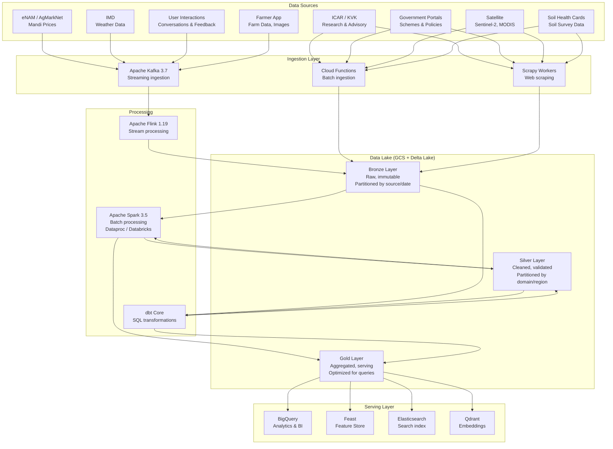
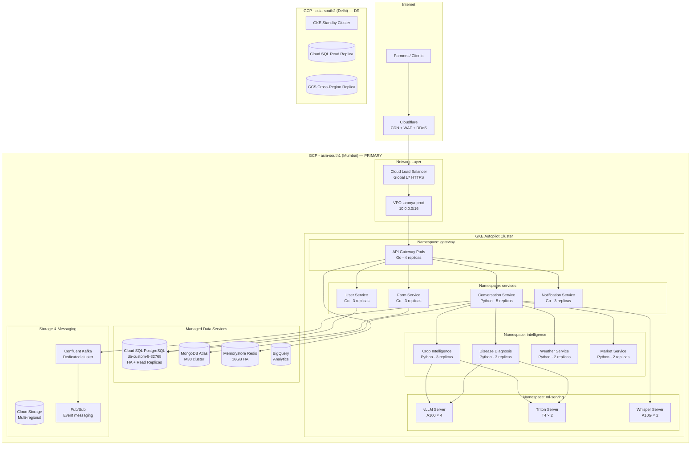
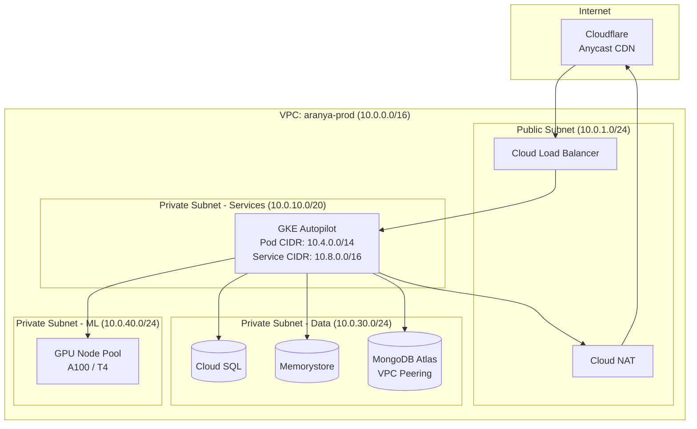
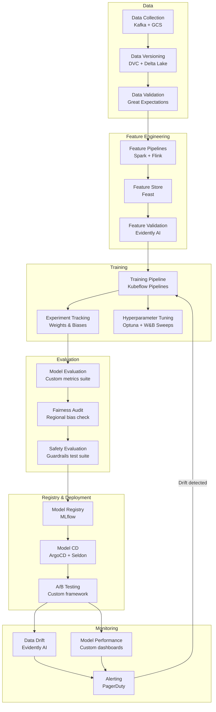
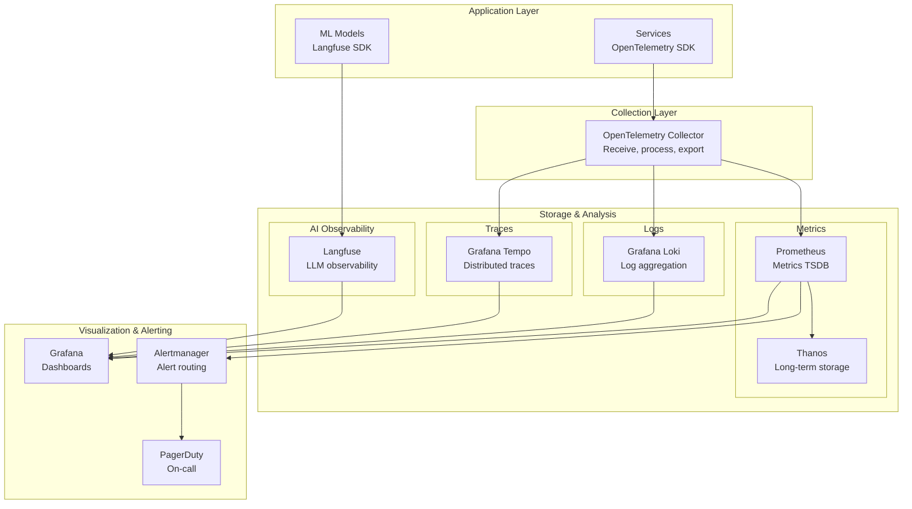

# Aranya.ai — Part 3: Data Infrastructure, DevOps & MLOps

> **Document Classification**: Confidential — Founding Team & Investors Only  
> **Version**: 1.0 | **Date**: June 2026  

---

## 1. Data Engineering Architecture

### 1.1 Data Lake Design



### 1.2 Data Source Integration Details

| Source | Format | Frequency | Volume/Day | Ingestion Method | Priority |
|--------|--------|-----------|-----------|-----------------|----------|
| **eNAM API** | REST JSON | Every 30 min | 500K records | Kafka + Flink | P0 |
| **AgMarkNet** | HTML scraping | Every 2 hours | 200K records | Scrapy → Kafka | P0 |
| **IMD Weather** | XML/JSON | Every 3 hours | 50K data points | HTTP poll → Kafka | P0 |
| **Open-Meteo** | REST JSON | Every hour | 640K villages | Batch HTTP → GCS | P0 |
| **ICAR Publications** | PDF/HTML | Weekly | 100-500 docs | Scrapy → GCS → LLM extract | P1 |
| **Government Schemes** | HTML/PDF | Weekly | 10-50 updates | Scrapy + manual review | P1 |
| **Sentinel-2 Satellite** | GeoTIFF | Every 5 days | 50GB/tile | GEE API → GCS | P2 |
| **Soil Health Cards** | CSV/API | Quarterly | 10M records | Bulk load → PostgreSQL | P2 |
| **User Interactions** | Protobuf events | Real-time | 5M events (V3) | Kafka direct | P0 |
| **Disease Images** | JPEG/PNG | Real-time | 100K images (V3) | GCS direct upload | P0 |

### 1.3 ETL/ELT Pipeline Architecture

#### Streaming Pipelines (Apache Flink)

```python
# Flink job: Real-time mandi price processing
class MandiPriceProcessor(FlinkJob):
    """
    Processes real-time mandi price updates from eNAM.
    Enriches with historical context and triggers alerts.
    """
    
    def process(self, event: MandiPriceEvent):
        # 1. Validate and clean
        validated = self.validate_price(event)
        if not validated:
            self.dead_letter(event)
            return
        
        # 2. Enrich with state/district metadata
        enriched = self.enrich(validated)
        
        # 3. Compute moving averages (7d, 30d, 90d)
        with_trends = self.compute_trends(enriched)
        
        # 4. Detect anomalies (price spikes/crashes)
        anomaly = self.detect_anomaly(with_trends)
        if anomaly:
            self.emit_alert("price.anomaly", anomaly)
        
        # 5. Write to Silver layer
        self.sink_delta(with_trends, "silver/market/mandi_prices")
        
        # 6. Update TimescaleDB for real-time serving
        self.sink_timescale(with_trends, "mandi_prices")
        
        # 7. Update Feature Store
        self.sink_feast(with_trends, "price_features")
```

#### Batch Pipelines (Apache Spark)

```python
# Spark job: Weekly knowledge base update
class KnowledgeBaseUpdater(SparkJob):
    """
    Weekly batch job to:
    1. Process new ICAR/KVK publications
    2. Extract structured knowledge using LLM
    3. Generate embeddings for RAG
    4. Update vector database
    """
    
    def run(self):
        # Read new documents from Bronze layer
        new_docs = (
            spark.read.format("delta")
            .load("gs://aranya-lake/bronze/publications/")
            .where(f"ingested_date >= '{self.last_run_date}'")
        )
        
        # Extract text from PDFs
        extracted = new_docs.rdd.map(self.extract_text)
        
        # Chunk with domain-aware strategy
        chunks = extracted.flatMap(self.agricultural_chunker)
        
        # Generate embeddings (BGE-M3)
        embeddings = chunks.mapPartitions(self.batch_embed)
        
        # Write to Gold layer
        embeddings.write.format("delta").mode("append").save(
            "gs://aranya-lake/gold/knowledge_embeddings/"
        )
        
        # Upsert to Qdrant
        self.upsert_qdrant(embeddings, "crop_knowledge")
```

### 1.4 Data Quality Framework

```yaml
# Great Expectations suite for mandi prices
suite_name: mandi_price_quality

expectations:
  - expect_column_values_to_not_be_null:
      column: commodity_code
  - expect_column_values_to_not_be_null:
      column: modal_price
  - expect_column_values_to_be_between:
      column: modal_price
      min_value: 0
      max_value: 500000  # INR per quintal
  - expect_column_values_to_be_between:
      column: min_price
      min_value: 0
  - expect_column_pair_values_a_to_be_less_than_b:
      column_a: min_price
      column_b: max_price
  - expect_column_values_to_be_in_set:
      column: state_code
      value_set: [MH, UP, MP, RJ, GJ, KA, TN, AP, ...]
  - expect_table_row_count_to_be_between:
      min_value: 1000  # At least 1K records per batch
      max_value: 1000000
```

### 1.5 Data Lineage & Catalog

| Tool | Purpose | Scope |
|------|---------|-------|
| **OpenLineage** | End-to-end lineage tracking | All Spark, Flink, dbt jobs |
| **DataHub** | Data catalog & discovery | All datasets, schemas, owners |
| **Great Expectations** | Data quality validation | All Silver → Gold transitions |
| **Delta Lake** | Time travel & versioning | All lake layers |

---

## 2. Cloud Infrastructure Architecture

### 2.1 Cloud Provider Comparison

| Criterion | AWS | GCP | Azure | **Winner** |
|-----------|-----|-----|-------|-----------|
| **India Regions** | Mumbai, Hyderabad | Mumbai (asia-south1), Delhi (asia-south2) | Mumbai, Pune, Chennai | Azure (3 regions) |
| **GPU Availability** | A100, H100 (limited) | A100, H100, TPU v5e | A100, H100 | GCP (TPUs + availability) |
| **Kubernetes** | EKS (good) | GKE Autopilot (excellent) | AKS (good) | **GCP** |
| **AI/ML Platform** | SageMaker, Bedrock | Vertex AI, Gemini native | Azure AI Studio | **GCP** |
| **Data Lake** | S3 + Glue + EMR | GCS + Dataproc + BigQuery | ADLS + Synapse | **GCP** (BigQuery) |
| **Managed Kafka** | MSK ($$$) | Confluent Cloud / Pub-Sub | Event Hubs | **GCP** (Pub/Sub cheaper) |
| **Startup Credits** | $100K (Activate) | $200K (for Startups) | $150K (Founders Hub) | **GCP** |
| **Cost (est. V2)** | ~$18K/mo | ~$14K/mo | ~$16K/mo | **GCP** |
| **Compliance** | Data localization ✅ | Data localization ✅ | Data localization ✅ | Tie |

> [!IMPORTANT]
> **Recommendation: GCP as Primary Cloud**
> - Best AI/ML ecosystem (Vertex AI, TPUs, Gemini integration)
> - GKE Autopilot is best-in-class managed Kubernetes
> - BigQuery for analytics is unmatched
> - Strongest India startup credits program ($200K)
> - Competitive pricing for GPU instances in Mumbai region
> 
> **AWS as secondary** for specific services (SES for email, some partners require AWS)

### 2.2 GCP Infrastructure Architecture



### 2.3 Kubernetes Architecture

```yaml
# GKE Autopilot Configuration
apiVersion: container.google.com/v1
kind: Cluster
metadata:
  name: aranya-prod
  location: asia-south1
spec:
  autopilot:
    enabled: true
  releaseChannel:
    channel: REGULAR
  networkConfig:
    enablePrivateNodes: true
    enablePrivateEndpoint: false  # API server accessible for CI/CD
  maintenancePolicy:
    window:
      startTime: "2026-01-01T02:00:00Z"  # 2 AM IST maintenance
      endTime: "2026-01-01T06:00:00Z"

---
# Namespace strategy
namespaces:
  - gateway          # API gateway, rate limiter
  - services         # Core business services
  - intelligence     # AI/ML intelligence services
  - ml-serving       # GPU model serving
  - data-pipeline    # Kafka consumers, Flink jobs
  - monitoring       # Prometheus, Grafana, Loki
  - security         # Vault, cert-manager

---
# HPA example for Conversation Service
apiVersion: autoscaling/v2
kind: HorizontalPodAutoscaler
metadata:
  name: conversation-service-hpa
  namespace: services
spec:
  scaleTargetRef:
    apiVersion: apps/v1
    kind: Deployment
    name: conversation-service
  minReplicas: 3
  maxReplicas: 50
  metrics:
    - type: Resource
      resource:
        name: cpu
        target:
          type: Utilization
          averageUtilization: 70
    - type: Pods
      pods:
        metric:
          name: http_requests_per_second
        target:
          type: AverageValue
          averageValue: "100"
  behavior:
    scaleUp:
      stabilizationWindowSeconds: 30
      policies:
        - type: Pods
          value: 5
          periodSeconds: 60
    scaleDown:
      stabilizationWindowSeconds: 300
      policies:
        - type: Pods
          value: 2
          periodSeconds: 120
```

### 2.4 Networking Architecture



### 2.5 Multi-Region & DR Strategy

| Component | Primary (Mumbai) | DR (Delhi) | RPO | RTO |
|-----------|-----------------|------------|-----|-----|
| **PostgreSQL** | Cloud SQL HA | Cross-region read replica | 0s (sync) | < 5 min |
| **MongoDB** | Atlas M30 | Atlas cross-region | < 1s | < 2 min |
| **Redis** | Memorystore HA | Cold standby | N/A (cache) | < 5 min (cold start) |
| **GCS** | Multi-regional | Auto-replicated | 0s | 0s |
| **Kafka** | Confluent Dedicated | Mirror topic | < 10s | < 10 min |
| **GKE** | Autopilot (active) | Autopilot (standby) | N/A | < 15 min |
| **DNS** | Cloud DNS (health check) | Auto-failover | N/A | < 2 min |

---

## 3. DevOps Architecture

### 3.1 CI/CD Pipeline

```mermaid
graph LR
    subgraph "CI (GitHub Actions)"
        PUSH[Git Push] --> LINT[Lint + Format<br/>ruff, golangci-lint]
        LINT --> TEST[Unit Tests<br/>pytest, go test]
        TEST --> BUILD[Build<br/>Docker multi-stage]
        BUILD --> SCAN[Security Scan<br/>Trivy + Snyk]
        SCAN --> INTEG[Integration Tests<br/>Testcontainers]
        INTEG --> PUSH_IMG[Push to<br/>Artifact Registry]
    end
    
    subgraph "CD (ArgoCD)"
        PUSH_IMG --> UPDATE[Update Helm Values<br/>in GitOps repo]
        UPDATE --> ARGO[ArgoCD Sync<br/>Detect diff]
        ARGO --> STAGING[Deploy Staging<br/>Full E2E tests]
        STAGING --> CANARY[Canary Deploy<br/>10% → 50% → 100%]
        CANARY --> PROD[Production<br/>Full rollout]
    end
    
    subgraph "Rollback"
        PROD --> MONITOR2[Monitor SLOs<br/>5 min window]
        MONITOR2 -->|SLO violated| ROLLBACK[Auto-Rollback<br/>ArgoCD revert]
    end
```



### 3.2 GitHub Actions Workflow

```yaml
# .github/workflows/ci.yml
name: CI Pipeline

on:
  push:
    branches: [main, develop]
  pull_request:
    branches: [main]

jobs:
  lint-and-test:
    runs-on: ubuntu-latest
    strategy:
      matrix:
        service: [user-service, farm-service, conversation-service, ...]
    steps:
      - uses: actions/checkout@v4
      
      - name: Detect changes
        uses: dorny/paths-filter@v3
        id: changes
        with:
          filters: |
            service:
              - 'services/${{ matrix.service }}/**'
      
      - name: Lint (Python)
        if: steps.changes.outputs.service == 'true'
        run: |
          cd services/${{ matrix.service }}
          ruff check . && ruff format --check .
      
      - name: Unit Tests
        if: steps.changes.outputs.service == 'true'
        run: |
          cd services/${{ matrix.service }}
          pytest tests/ -v --cov=src --cov-report=xml
      
      - name: Build Docker Image
        if: steps.changes.outputs.service == 'true'
        run: |
          docker build -t asia-south1-docker.pkg.dev/aranya-prod/${{ matrix.service }}:${{ github.sha }} \
            -f services/${{ matrix.service }}/Dockerfile .
      
      - name: Security Scan
        uses: aquasecurity/trivy-action@master
        with:
          image-ref: asia-south1-docker.pkg.dev/aranya-prod/${{ matrix.service }}:${{ github.sha }}
          severity: CRITICAL,HIGH
          exit-code: 1
      
      - name: Push to Artifact Registry
        if: github.ref == 'refs/heads/main'
        run: |
          gcloud auth configure-docker asia-south1-docker.pkg.dev
          docker push asia-south1-docker.pkg.dev/aranya-prod/${{ matrix.service }}:${{ github.sha }}
```

### 3.3 Helm Chart Structure

```
helm/
├── charts/
│   ├── aranya-common/          # Shared templates
│   │   ├── templates/
│   │   │   ├── deployment.yaml
│   │   │   ├── service.yaml
│   │   │   ├── hpa.yaml
│   │   │   ├── pdb.yaml
│   │   │   └── servicemonitor.yaml
│   │   └── values.yaml
│   ├── user-service/
│   │   └── values.yaml         # Service-specific overrides
│   ├── conversation-service/
│   │   └── values.yaml
│   └── ...
├── environments/
│   ├── dev/
│   │   └── values.yaml
│   ├── staging/
│   │   └── values.yaml
│   └── prod/
│       └── values.yaml
└── Chart.yaml
```

### 3.4 Infrastructure as Code (Terraform)

```
terraform/
├── modules/
│   ├── gke-cluster/
│   │   ├── main.tf
│   │   ├── variables.tf
│   │   └── outputs.tf
│   ├── cloud-sql/
│   ├── memorystore/
│   ├── gcs-buckets/
│   ├── networking/
│   ├── iam/
│   └── monitoring/
├── environments/
│   ├── dev/
│   │   ├── main.tf          # Module compositions
│   │   ├── terraform.tfvars
│   │   └── backend.tf
│   ├── staging/
│   └── prod/
├── global/
│   ├── dns.tf
│   ├── iam-org.tf
│   └── artifact-registry.tf
└── README.md
```

```hcl
# terraform/modules/gke-cluster/main.tf
resource "google_container_cluster" "primary" {
  name     = "${var.project_name}-${var.environment}"
  location = var.region
  
  enable_autopilot = true
  
  release_channel {
    channel = "REGULAR"
  }
  
  private_cluster_config {
    enable_private_nodes    = true
    enable_private_endpoint = false
    master_ipv4_cidr_block = "172.16.0.0/28"
  }
  
  network    = var.vpc_id
  subnetwork = var.subnet_id
  
  maintenance_policy {
    recurring_window {
      start_time = "2026-01-01T20:30:00Z"  # 2 AM IST
      end_time   = "2026-01-02T00:30:00Z"
      recurrence = "FREQ=WEEKLY;BYDAY=SU"
    }
  }
  
  resource_labels = {
    environment = var.environment
    team        = "platform"
    cost-center = "engineering"
  }
}
```

### 3.5 Container Strategy

```dockerfile
# Multi-stage build for Python services
# Stage 1: Build
FROM python:3.12-slim AS builder
WORKDIR /app
COPY requirements.txt .
RUN pip install --no-cache-dir --prefix=/install -r requirements.txt
COPY src/ ./src/

# Stage 2: Runtime
FROM python:3.12-slim AS runtime
RUN useradd --create-home appuser
WORKDIR /app
COPY --from=builder /install /usr/local
COPY --from=builder /app/src ./src
USER appuser
EXPOSE 8000
HEALTHCHECK --interval=30s --timeout=5s CMD curl -f http://localhost:8000/health
CMD ["uvicorn", "src.main:app", "--host", "0.0.0.0", "--port", "8000"]

# For Go services: use distroless
# FROM gcr.io/distroless/static-debian12
```

---

## 4. MLOps Architecture

### 4.1 ML Lifecycle



### 4.2 Feature Store (Feast)

```python
# feature_store/feature_definitions.py

from feast import Entity, Feature, FeatureView, FileSource, Field
from feast.types import Float32, String, Int32, UnixTimestamp

# Entities
farmer = Entity(name="farmer_id", join_keys=["farmer_id"])
farm = Entity(name="farm_id", join_keys=["farm_id"])
crop = Entity(name="crop_code", join_keys=["crop_code"])

# Feature Views
farmer_features = FeatureView(
    name="farmer_features",
    entities=[farmer],
    ttl=timedelta(days=1),
    schema=[
        Field(name="total_farms", dtype=Int32),
        Field(name="total_area_acres", dtype=Float32),
        Field(name="primary_crop", dtype=String),
        Field(name="avg_yield_last_3y", dtype=Float32),
        Field(name="disease_reports_count", dtype=Int32),
        Field(name="interaction_count_30d", dtype=Int32),
        Field(name="risk_appetite_score", dtype=Float32),
    ],
    online=True,
    source=BigQuerySource(
        table="aranya-prod.features.farmer_features",
        timestamp_field="event_timestamp",
    ),
)

weather_features = FeatureView(
    name="weather_features",
    entities=[farm],
    ttl=timedelta(hours=6),  # Refresh every 6 hours
    schema=[
        Field(name="temperature_avg_7d", dtype=Float32),
        Field(name="rainfall_total_7d", dtype=Float32),
        Field(name="humidity_avg_7d", dtype=Float32),
        Field(name="rainfall_forecast_7d", dtype=Float32),
        Field(name="heatwave_risk", dtype=Float32),
        Field(name="drought_index", dtype=Float32),
    ],
    online=True,
    source=BigQuerySource(
        table="aranya-prod.features.weather_features",
        timestamp_field="event_timestamp",
    ),
)

market_features = FeatureView(
    name="market_features",
    entities=[crop],
    ttl=timedelta(hours=1),  # Near real-time prices
    schema=[
        Field(name="modal_price_today", dtype=Float32),
        Field(name="price_change_7d_pct", dtype=Float32),
        Field(name="price_change_30d_pct", dtype=Float32),
        Field(name="demand_index", dtype=Float32),
        Field(name="arrival_quantity_avg", dtype=Float32),
        Field(name="price_volatility_30d", dtype=Float32),
    ],
    online=True,
    source=BigQuerySource(
        table="aranya-prod.features.market_features",
        timestamp_field="event_timestamp",
    ),
)
```

### 4.3 Experiment Tracking (Weights & Biases)

```python
# Training script with W&B tracking
import wandb

wandb.init(
    project="aranya-crop-disease",
    config={
        "model": "vit-b-16",
        "dataset_version": "v2.3",
        "dataset_size": 200000,
        "learning_rate": 1e-4,
        "batch_size": 32,
        "epochs": 50,
        "augmentation": "randaugment",
        "freeze_backbone": True,
        "num_classes": 38,
    },
    tags=["disease-detection", "production-candidate"],
)

# Log metrics per epoch
wandb.log({
    "train_loss": train_loss,
    "val_loss": val_loss,
    "val_accuracy": val_accuracy,
    "val_f1_macro": val_f1,
    "val_f1_per_class": dict(zip(class_names, f1_per_class)),
    "ece": expected_calibration_error,
    "confusion_matrix": wandb.plot.confusion_matrix(
        y_true=y_true, preds=y_pred, class_names=class_names
    ),
})

# Log model artifact
artifact = wandb.Artifact("crop-disease-vit-v1", type="model")
artifact.add_file("model.pth")
wandb.log_artifact(artifact)
```

### 4.4 Model Registry (MLflow)

```python
import mlflow

# Register model after training
with mlflow.start_run():
    mlflow.log_params(config)
    mlflow.log_metrics({"accuracy": 0.92, "f1": 0.89, "ece": 0.04})
    
    mlflow.pytorch.log_model(
        model,
        "crop-disease-model",
        registered_model_name="AranyaVision-CropDisease",
        signature=infer_signature(sample_input, sample_output),
    )

# Model stages: None → Staging → Production → Archived
client = mlflow.MlflowClient()
client.transition_model_version_stage(
    name="AranyaVision-CropDisease",
    version=3,
    stage="Production",
    archive_existing_versions=True,
)
```

### 4.5 Model Serving Architecture

| Model Type | Serving Platform | Hardware | Replicas | Scaling |
|-----------|-----------------|----------|----------|---------|
| **LLM (Llama 70B)** | vLLM | 4× A100 80GB | 1-4 | GPU-based |
| **Disease ViT** | Triton | 2× T4 16GB | 2-8 | Request count |
| **Whisper V3** | Custom FastAPI + CTranslate2 | 2× A10G 24GB | 2-6 | Queue depth |
| **Embeddings** | Triton | 2× T4 16GB | 2-4 | Request count |
| **TFLite (on-device)** | Android runtime | Mobile CPU/GPU | N/A | N/A |

### 4.6 Continuous Evaluation

```python
class ContinuousEvaluator:
    """
    Runs hourly evaluation of model performance.
    Triggers retraining alerts if metrics drop.
    """
    
    THRESHOLDS = {
        "disease_classification": {
            "accuracy": 0.85,      # Alert if drops below
            "f1_macro": 0.80,
            "calibration_ece": 0.10,  # Alert if rises above
        },
        "crop_recommendation": {
            "ndcg@5": 0.75,
            "user_satisfaction": 3.5,  # out of 5
        },
        "asr_hindi": {
            "wer": 0.12,  # Alert if rises above 12%
        },
    }
    
    async def evaluate(self):
        for model_name, thresholds in self.THRESHOLDS.items():
            metrics = await self.compute_metrics(model_name)
            
            for metric_name, threshold in thresholds.items():
                if self.is_violation(metrics[metric_name], threshold):
                    await self.alert(
                        model=model_name,
                        metric=metric_name,
                        current=metrics[metric_name],
                        threshold=threshold,
                        severity="critical" if self.is_severe(metrics) else "warning"
                    )
```

---

## 5. Observability Stack

### 5.1 Observability Architecture



### 5.2 Key Metrics & SLOs

| Service | SLI | SLO | Alert Threshold |
|---------|-----|-----|----------------|
| **API Gateway** | Availability | 99.9% | < 99.5% for 5 min |
| **API Gateway** | Latency (p99) | < 500ms | > 1s for 5 min |
| **Conversation** | Success rate | 99.5% | < 99% for 5 min |
| **Conversation** | E2E latency (p95) | < 2s (text), < 3s (voice) | > 5s for 5 min |
| **Disease Diagnosis** | Accuracy | > 85% | < 80% (daily eval) |
| **ASR (Hindi)** | WER | < 10% | > 15% (hourly eval) |
| **LLM Inference** | Latency (p95) | < 1.5s | > 3s for 5 min |
| **LLM Inference** | Error rate | < 1% | > 5% for 2 min |
| **Kafka** | Consumer lag | < 1000 msgs | > 10K for 5 min |

### 5.3 AI Observability (Langfuse)

```python
from langfuse import Langfuse
from langfuse.decorators import observe

langfuse = Langfuse()

@observe(as_type="generation")
async def generate_recommendation(query: str, context: dict) -> str:
    """
    Tracked metrics per LLM call:
    - Input/output tokens
    - Latency
    - Cost
    - Model version
    - Prompt template version
    - User satisfaction (async feedback)
    - Hallucination score (async evaluation)
    """
    response = await llm_gateway.generate(
        model="gemini-2.5-flash",
        messages=[
            {"role": "system", "content": CROP_SYSTEM_PROMPT_V3},
            {"role": "user", "content": query},
        ],
        temperature=0.3,
        max_tokens=1000,
    )
    
    # Track in Langfuse
    langfuse.score(
        trace_id=langfuse.get_trace_id(),
        name="relevance",
        value=context.get("relevance_score", 0),
    )
    
    return response
```

### 5.4 Dashboard Structure

| Dashboard | Audience | Key Panels |
|-----------|----------|------------|
| **Platform Overview** | CTO, on-call | RPS, error rate, latency, active users |
| **AI Performance** | ML team | Model accuracy, inference latency, token costs |
| **Farmer Experience** | Product | Conversation success, satisfaction, retention |
| **Infrastructure** | DevOps | CPU/memory, pod count, node health, costs |
| **Data Pipeline** | Data team | Pipeline freshness, quality scores, Kafka lag |
| **Cost** | Finance | Cloud spend, per-farmer cost, AI API costs |

### 5.5 Alerting Tiers

| Tier | Response Time | Channel | Example |
|------|-------------|---------|---------|
| **P0 — Critical** | < 5 min | PagerDuty call + Slack | Platform down, data breach |
| **P1 — High** | < 30 min | PagerDuty page + Slack | Error rate > 5%, LLM down |
| **P2 — Medium** | < 4 hours | Slack only | Kafka lag, model accuracy drop |
| **P3 — Low** | Next business day | Email + Slack | Disk usage warning, cert expiry |

---

> [!NOTE]
> **Next**: See [Part 4 — Security, Scalability & Roadmap](./04-security-scalability-roadmap.md) for Security Architecture, Scalability Design, Roadmap, Cost Analysis, Risk Assessment, and Competitive Moat Analysis.
