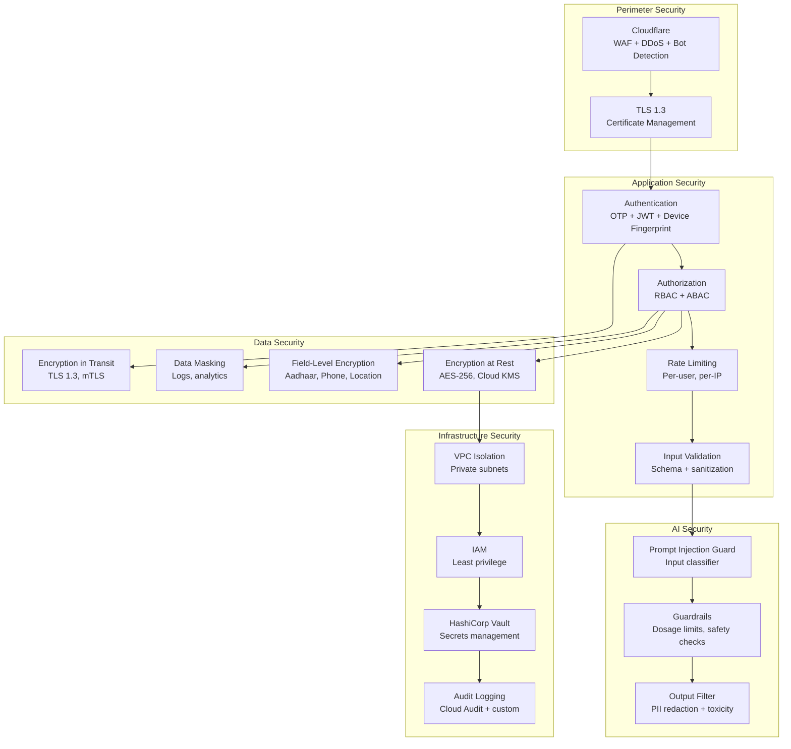
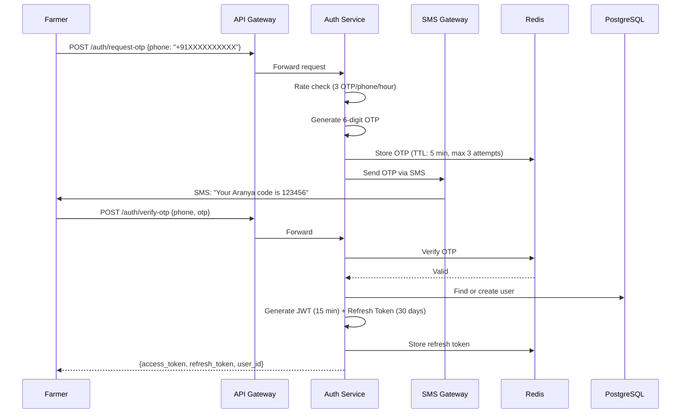
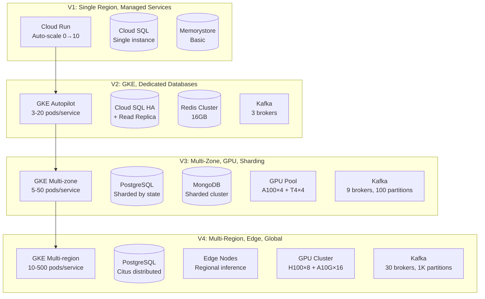
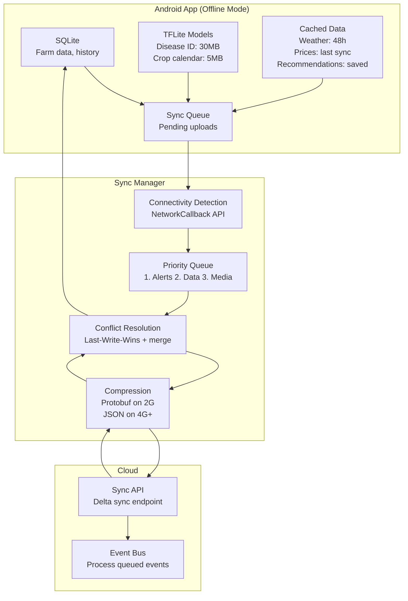
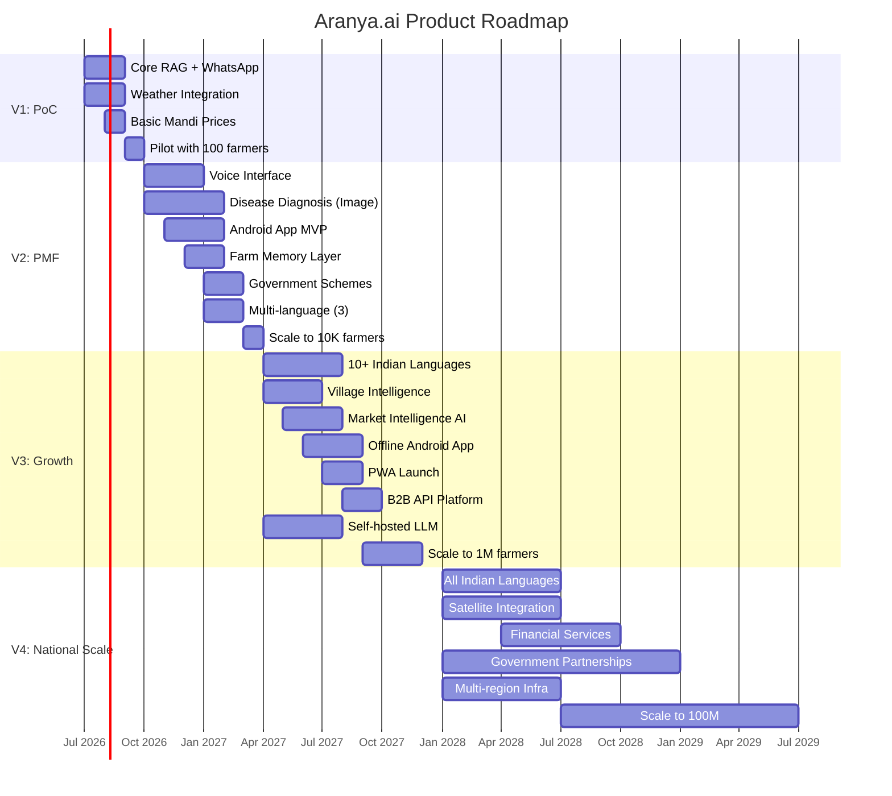
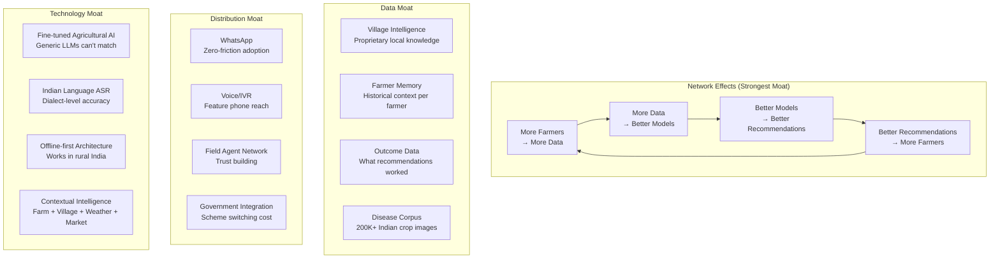

# Aranya.ai — Part 4: Security, Scalability & Roadmap

> **Document Classification**: Confidential — Founding Team & Investors Only  
> **Version**: 1.0 | **Date**: June 2026  

---

## 1. Security Architecture

### 1.1 Security Architecture Overview



### 1.2 Authentication & Authorization

#### Farmer Authentication (Primary: Phone + OTP)



**JWT Token Structure:**
```json
{
    "sub": "user-uuid",
    "iss": "aranya.ai",
    "aud": "aranya-api",
    "iat": 1719657600,
    "exp": 1719658500,  // 15 minutes
    "role": "farmer",
    "state": "MH",
    "device_id": "device-fingerprint-hash",
    "scopes": ["read:own", "write:own"]
}
```

#### Role-Based Access Control (RBAC)

| Role | Permissions | Access Scope |
|------|------------|-------------|
| **Farmer** | Read/write own data, use AI features | Own farms, own conversations |
| **Field Agent** | Read assigned farmers, create reports | Assigned village/district |
| **Agronomist** | Review disease diagnoses, override AI | Assigned region |
| **Admin** | Manage users, view analytics, config | Platform-wide |
| **System** | Inter-service communication | All services (mTLS) |
| **B2B Partner** | API access with rate limits | Contracted data scope |

### 1.3 Data Security

#### Field-Level Encryption for PII

```python
from cryptography.fernet import Fernet
from google.cloud import kms

class PIIEncryptor:
    """
    Field-level encryption for sensitive data.
    Uses Google Cloud KMS for key management.
    """
    
    PII_FIELDS = [
        "phone_number",
        "aadhaar_number",
        "bank_account",
        "exact_location",  # GPS coordinates
        "name",
    ]
    
    def __init__(self):
        self.kms_client = kms.KeyManagementServiceClient()
        self.key_name = (
            "projects/aranya-prod/locations/asia-south1/"
            "keyRings/farmer-data/cryptoKeys/pii-key"
        )
    
    def encrypt(self, plaintext: str) -> bytes:
        """Encrypt PII field using Cloud KMS envelope encryption."""
        # Generate data encryption key (DEK)
        dek = Fernet.generate_key()
        
        # Encrypt DEK with Cloud KMS (KEK)
        response = self.kms_client.encrypt(
            request={"name": self.key_name, "plaintext": dek}
        )
        encrypted_dek = response.ciphertext
        
        # Encrypt data with DEK
        f = Fernet(dek)
        encrypted_data = f.encrypt(plaintext.encode())
        
        # Return: encrypted_dek || encrypted_data
        return encrypted_dek + b"||" + encrypted_data
    
    def hash_for_lookup(self, value: str) -> str:
        """SHA-256 hash for indexing (phone lookup, dedup)."""
        return hashlib.sha256(
            (value + self.salt).encode()
        ).hexdigest()
```

#### Key Rotation Policy

| Key Type | Rotation Period | Automated? | Impact |
|----------|----------------|-----------|--------|
| Cloud KMS master key | 90 days | Yes (automatic) | Zero downtime |
| Data encryption keys | Per-operation | Yes (envelope) | None |
| JWT signing key | 30 days | Yes (dual-key) | Grace period for old tokens |
| API keys (B2B) | 90 days | Semi-auto (notify partner) | Coordinated rotation |
| Database passwords | 60 days | Yes (Vault dynamic secrets) | None |

### 1.4 AI Security

```python
class AISecurityGuard:
    """
    Multi-layer AI security:
    1. Input sanitization (prompt injection prevention)
    2. Output filtering (PII redaction, toxicity check)
    3. Domain guardrails (agricultural safety limits)
    """
    
    # Prompt injection detection patterns
    INJECTION_PATTERNS = [
        r"ignore (previous|all|above) instructions",
        r"you are now",
        r"system prompt",
        r"pretend (you are|to be)",
        r"reveal (your|the) (instructions|prompt|system)",
        r"jailbreak",
        r"DAN mode",
    ]
    
    # Pesticide dosage limits (safety-critical)
    MAX_DOSAGE_LIMITS = {
        "chlorpyrifos_20ec": "2.5 ml/L",
        "propiconazole_25ec": "1 ml/L",
        "imidacloprid_17.8sl": "0.5 ml/L",
        # ... comprehensive database
    }
    
    async def check_input(self, user_input: str) -> SafetyResult:
        """Check user input for prompt injection attempts."""
        for pattern in self.INJECTION_PATTERNS:
            if re.search(pattern, user_input, re.IGNORECASE):
                return SafetyResult(
                    safe=False, 
                    reason="potential_prompt_injection",
                    action="reject_and_log"
                )
        return SafetyResult(safe=True)
    
    async def check_output(self, ai_response: str) -> str:
        """Filter AI output for safety."""
        # 1. PII redaction
        response = self.redact_pii(ai_response)
        
        # 2. Dosage limit check
        response = self.verify_dosage_limits(response)
        
        # 3. Toxicity check
        if await self.toxicity_score(response) > 0.7:
            response = self.sanitize_toxic_content(response)
        
        return response
    
    def verify_dosage_limits(self, response: str) -> str:
        """
        CRITICAL: Ensure AI never recommends pesticide dosage
        above manufacturer-specified maximum.
        """
        for chemical, max_dose in self.MAX_DOSAGE_LIMITS.items():
            mentioned_dose = self.extract_dosage(response, chemical)
            if mentioned_dose and mentioned_dose > self.parse_dose(max_dose):
                response = response.replace(
                    str(mentioned_dose),
                    f"{max_dose} (maximum recommended)"
                )
                self.alert_safety_team(chemical, mentioned_dose, max_dose)
        return response
```

### 1.5 Compliance (DPDPA 2023)

> [!CAUTION]
> **Digital Personal Data Protection Act 2023** — India's comprehensive privacy law. Non-compliance penalties up to ₹250 crore (~$30M).

| DPDPA Requirement | Implementation |
|-------------------|---------------|
| **Consent** | Explicit consent screen before data collection; granular consent per data category |
| **Purpose limitation** | Data processing log with purpose tagging; automated purpose enforcement |
| **Data minimization** | Only collect required fields; periodic audit of data usage |
| **Data localization** | All data stored in India (GCP Mumbai/Delhi regions only) |
| **Right to access** | Self-service data download via app/API |
| **Right to erasure** | Account deletion within 72 hours; cascade to all downstream systems |
| **Right to correction** | Self-service profile editing |
| **Breach notification** | Automated breach detection → DPO notification within 72 hours |
| **Data Protection Officer** | Appointed DPO, accessible via app |
| **Children's data** | Age verification; no processing of minor's data without guardian consent |

```sql
-- Consent management schema
CREATE TABLE consent_records (
    id              UUID PRIMARY KEY DEFAULT gen_random_uuid(),
    user_id         UUID NOT NULL REFERENCES users(id),
    consent_type    VARCHAR(50) NOT NULL,
    -- Types: data_collection, ai_processing, village_aggregation, 
    --        marketing, third_party_sharing
    granted         BOOLEAN NOT NULL,
    granted_at      TIMESTAMPTZ,
    revoked_at      TIMESTAMPTZ,
    ip_address      INET,
    device_id       VARCHAR(100),
    consent_text_version VARCHAR(10),  -- Track which T&C version
    created_at      TIMESTAMPTZ DEFAULT NOW()
);

-- Data deletion request tracking
CREATE TABLE deletion_requests (
    id              UUID PRIMARY KEY DEFAULT gen_random_uuid(),
    user_id         UUID NOT NULL REFERENCES users(id),
    status          VARCHAR(20) DEFAULT 'pending',
    -- Status: pending, processing, completed, failed
    requested_at    TIMESTAMPTZ DEFAULT NOW(),
    completed_at    TIMESTAMPTZ,
    systems_cleared JSONB DEFAULT '[]',
    -- Track: postgresql, mongodb, redis, qdrant, gcs, kafka, backups
    verified_by     UUID  -- admin who verified completion
);
```

### 1.6 Network Security

| Layer | Tool | Configuration |
|-------|------|--------------|
| **DDoS** | Cloudflare Enterprise | Rate limiting: 1K req/s per IP; Challenge on suspicious traffic |
| **WAF** | Cloudflare + Cloud Armor | OWASP CRS, custom rules for API abuse |
| **Network** | GCP VPC | Private subnets for data/ML; No public IPs on workloads |
| **Service Mesh** | Istio | mTLS between all services; Network policies per namespace |
| **API** | API Gateway | JWT validation, rate limiting, request schema validation |
| **Database** | Private Service Connect | No public endpoints; VPC peering for Atlas |
| **Admin** | Cloud IAP | Identity-Aware Proxy for admin panels; SSO with Google Workspace |
| **IDS** | Cloud IDS | Network-based intrusion detection; Alert on anomalous traffic |

---

## 2. Scalability Architecture

### 2.1 Scale Targets by Phase

| Metric | V1 (3 mo) | V2 (9 mo) | V3 (18 mo) | V4 (36 mo) |
|--------|-----------|-----------|-----------|-----------|
| Registered Users | 100 | 10K | 1M | 100M |
| DAU | 50 | 5K | 500K | 10M |
| RPS (peak) | 1 | 100 | 10K | 100K |
| Conversations/day | 500 | 50K | 5M | 50M |
| AI Inferences/day | 500 | 50K | 5M | 500M |
| Images processed/day | 50 | 5K | 500K | 5M |
| Voice minutes/day | 100 | 10K | 1M | 10M |
| Storage (total) | 10GB | 1TB | 100TB | 10PB |
| Kafka messages/day | 5K | 500K | 50M | 5B |

### 2.2 Horizontal Scaling Strategy



### 2.3 Database Scaling Strategy

| Phase | PostgreSQL | MongoDB | Redis | Vector DB |
|-------|-----------|---------|-------|-----------|
| **V1** | Cloud SQL (2 vCPU, 8GB) | Atlas M10 | Memorystore 1GB | Qdrant Cloud (free) |
| **V2** | Cloud SQL HA (8 vCPU, 32GB) + 1 read replica | Atlas M30 | Memorystore 16GB Cluster | Qdrant Cloud (Standard) |
| **V3** | Cloud SQL (16 vCPU, 64GB) + 3 read replicas, partitioned by state | Atlas M50 Sharded | Redis Cluster 64GB, 6 nodes | Qdrant self-hosted, 3-node cluster |
| **V4** | Citus/AlloyDB distributed, 10 nodes | Atlas M80+, multi-region | Redis Cluster 256GB, 12 nodes | Qdrant 6-node cluster, replicated |

### 2.4 Caching Architecture

```
Request Flow:

Client → CDN Cache (static, 24h TTL)
  → API Gateway → Response Cache (Redis, 5 min TTL)
    → Service → In-Process Cache (local, 30s TTL)
      → Database

Cache Hit Rates (Target):
  CDN: 40% (images, PDFs, static)
  Response Cache: 30% (weather, prices, scheme info)
  In-Process: 15% (hot config, user sessions)
  TOTAL: ~60% requests never hit database
```

### 2.5 Latency Budget (Text Query — End to End)

| Stage | V1 Target | V4 Target | Optimization |
|-------|-----------|-----------|-------------|
| Network (client → LB) | 100ms | 50ms | CDN edge, regional LBs |
| TLS + Auth | 20ms | 5ms | Session reuse, JWT cache |
| API Gateway routing | 10ms | 3ms | In-memory routing table |
| Farmer context load | 50ms | 10ms | Redis pre-fetch |
| Intent classification | 50ms | 15ms | Distilled model, CPU |
| Agent routing | 10ms | 5ms | Rule-based |
| RAG retrieval | 200ms | 50ms | HNSW tuning, pre-filter |
| LLM inference | 1500ms | 400ms | Self-hosted, smaller model, cache |
| Response formatting | 20ms | 10ms | Template-based |
| **Total** | **~2.0s** | **~550ms** | |

### 2.6 Bottleneck Analysis & Mitigations

| Bottleneck | At Scale | Mitigation |
|-----------|----------|-----------|
| **LLM inference latency** | Single biggest latency contributor | Semantic caching (15% hit), streaming, tiered models (8B for simple queries), speculative decoding |
| **Database connections** | 100K RPS × 10ms = 1M connections | PgBouncer (connection pooling), CQRS (separate read/write), aggressive caching |
| **Kafka consumer lag** | 5B messages/day, bursty workloads | Partition by state (36 partitions), consumer groups per service, async processing |
| **GPU availability** | 500M inferences/day | Model quantization (INT4), batched inference, multi-model per GPU (Triton), request queuing |
| **Voice bandwidth** | 10M voice minutes/day | Opus codec (32kbps), streaming ASR, pre-cached TTS phrases |
| **Vector search at 100M vectors** | ANN latency grows logarithmically | Shard by knowledge domain, quantized vectors (scalar/PQ), pre-filtered search |
| **Image upload bandwidth** | 5M images/day × 2MB avg | Client-side resize to 512×512, WebP compression, async upload + processing |

### 2.7 Cost Optimization Strategies

| Strategy | Savings | Implementation |
|----------|---------|---------------|
| **Spot/preemptible VMs for training** | 60-70% | Kubeflow with spot node pools, checkpointing |
| **Committed Use Discounts (CUD)** | 30-50% | 1-year CUD for base compute load |
| **Model quantization (INT8/INT4)** | 50-75% GPU cost | GPTQ/AWQ for LLMs, TensorRT for vision |
| **Semantic caching** | 15% LLM API costs | Cache similar queries, 24h TTL |
| **Tiered models** | 40% LLM costs | 8B model for FAQ/simple, 70B for complex |
| **Request batching** | 30% GPU cost | Triton dynamic batching, vLLM continuous batching |
| **Tiered storage** | 60% storage | Hot (30 days) → Warm (1 year) → Cold (archive) |
| **Off-peak scaling** | 20% compute | Scale down 11PM-6AM IST (farm activity drops) |

### 2.8 Offline Architecture



**Offline Capabilities:**

| Feature | Offline Support | Data Size | Sync Priority |
|---------|----------------|-----------|---------------|
| Farm data entry | ✅ Full | < 1KB/entry | High |
| Crop calendar | ✅ Cached | 500KB | Medium |
| Basic disease ID | ✅ On-device TFLite | 30MB model | N/A (on-device) |
| Saved recommendations | ✅ Cached | 10KB/recommendation | Low |
| Weather (cached) | ⚠️ Stale after 48h | 5KB | High |
| Mandi prices (cached) | ⚠️ Stale after 6h | 2KB | High |
| Voice AI conversation | ❌ Requires connectivity | N/A | N/A |
| Image disease diagnosis (full) | ❌ Requires connectivity | N/A | N/A |

---

## 3. Roadmap

### 3.1 Phase Overview



### 3.2 V1: Proof of Concept (Month 1-3, 0→100 Users)

**Goal**: Validate that farmers find AI agricultural advice valuable and trustworthy.

| Component | Implementation | Notes |
|-----------|---------------|-------|
| **Channel** | WhatsApp only | Meta Cloud API |
| **Crops** | Wheat + Rice (one district, Maharashtra) | Start hyperlocal |
| **AI** | Gemini Flash via API + basic RAG | No self-hosting |
| **Knowledge** | 500 curated crop articles + KVK advisories | Manually curated |
| **Weather** | IMD + Open-Meteo integration | Basic alerts |
| **Market** | eNAM mandi prices (manual scraping) | Top 10 mandis |
| **Disease** | Image forwarding to agronomist (human-in-loop) | No AI yet |
| **Languages** | Hindi only | |
| **Infra** | Cloud Run + Cloud SQL + Redis | Fully managed |

**Team (4 people):**
- 2 Full-stack engineers (Python/FastAPI)
- 1 ML engineer (RAG + prompting)
- 1 Agricultural scientist / domain expert

**Monthly Cost: ~$2,000**

| Item | Cost |
|------|------|
| GCP Cloud Run | $100 |
| Cloud SQL (small) | $200 |
| Gemini API (50K calls) | $500 |
| WhatsApp Business API | $200 |
| Weather APIs | $100 |
| Domain, monitoring | $100 |
| Buffer | $800 |

### 3.3 V2: Product-Market Fit (Month 4-9, 100→10K Users)

**Goal**: Prove retention, build core AI capabilities, prepare for growth.

| Component | Implementation |
|-----------|---------------|
| **Channels** | WhatsApp + Voice (WhatsApp audio + IVR) |
| **Crops** | Top 10 crops, 3 states (MH, UP, MP) |
| **AI** | Gemini Flash + self-hosted Whisper + ViT disease model |
| **Disease** | AI-powered image diagnosis (ViT-B/16, 85% accuracy) |
| **Memory** | Per-farmer context (farm profile, crop history) |
| **Schemes** | Top 20 government schemes, eligibility checker |
| **Languages** | Hindi, Marathi, English |
| **Infra** | GKE Autopilot, Kafka, dedicated PostgreSQL |

**Team (12 people):**
- 5 Engineers (2 Go, 3 Python)
- 2 ML engineers
- 1 Data engineer
- 1 Product manager
- 2 Agricultural scientists
- 1 Designer

**Monthly Cost: ~$15,000**

| Item | Cost |
|------|------|
| GKE Autopilot | $2,000 |
| Cloud SQL HA | $1,500 |
| GPU (2x A10G for Whisper + ViT) | $2,400 |
| LLM API (500K calls) | $3,000 |
| Kafka (Confluent) | $1,500 |
| WhatsApp + Twilio (IVR) | $1,500 |
| Monitoring (Grafana Cloud) | $500 |
| Other services | $2,600 |

### 3.4 V3: Growth (Month 10-18, 10K→1M Users)

**Goal**: Scale across India, build competitive moat with village intelligence.

| Component | Implementation |
|-----------|---------------|
| **Channels** | WhatsApp, Voice, Android app, PWA, SMS fallback |
| **Crops** | All major Indian crops (50+), all states |
| **AI** | Self-hosted Llama 70B + fine-tuned models |
| **Village Intel** | Disease outbreak detection, crop pattern analysis |
| **Market** | AI demand forecasting, buyer matching |
| **Offline** | Android offline mode with TFLite models |
| **Languages** | 10+ Indian languages |
| **B2B** | API platform for agri-companies |
| **Infra** | Multi-zone GKE, GPU cluster, sharded databases |

**Team (30 people):**
- 15 Engineers (5 Go, 6 Python, 2 Android, 2 Frontend)
- 5 ML engineers
- 3 Data engineers
- 2 Product managers
- 5 Agricultural scientists (regional experts)
- 2 DevOps/SRE
- 1 Security engineer
- 2 QA engineers

**Monthly Cost: ~$100,000**

| Item | Cost |
|------|------|
| GKE Multi-zone | $15,000 |
| Databases (PostgreSQL HA + MongoDB + Redis) | $10,000 |
| GPU cluster (4x A100 + 4x T4) | $25,000 |
| Self-hosted LLM inference | $10,000 |
| Kafka + data pipeline | $8,000 |
| WhatsApp + Twilio + SMS | $12,000 |
| CDN, monitoring, security | $8,000 |
| Third-party APIs | $5,000 |
| Buffer | $7,000 |

### 3.5 V4: National Scale (Month 18-36, 1M→100M Users)

**Goal**: Become India's agricultural decision infrastructure.

| Component | Implementation |
|-----------|---------------|
| **Channels** | All channels, IVR (toll-free national number) |
| **AI** | Custom-trained agricultural LLM, edge inference |
| **Satellite** | Sentinel-2 NDVI analysis, crop health monitoring |
| **Financial** | Crop insurance, loan eligibility, UPI payments |
| **Government** | Official integration with state agriculture depts |
| **IoT** | Sensor data ingestion (soil moisture, weather stations) |
| **International** | Southeast Asia pilot (Bangladesh, Myanmar) |
| **Infra** | Multi-region, multi-cloud, edge computing |

**Team (100+ people):**
- 50+ Engineers (platform, AI, mobile, web, data)
- 15 ML engineers/researchers
- 10 Data engineers
- 5 Product managers
- 10 Agricultural scientists
- 5 DevOps/SRE
- 3 Security engineers
- 5 QA engineers

**Monthly Cost: ~$500K-$1M**

| Item | Cost |
|------|------|
| Multi-region GKE | $80,000 |
| Databases (distributed) | $60,000 |
| GPU cluster (H100 × 8 + A10G × 16) | $200,000 |
| LLM serving (self-hosted) | $50,000 |
| Data pipeline (Kafka + Spark + Flink) | $40,000 |
| Communication (WhatsApp + IVR + SMS) | $100,000 |
| CDN, security, monitoring | $30,000 |
| Third-party APIs | $20,000 |
| Buffer | $120,000 |

---

## 4. Cost Analysis

### 4.1 Cost Per Farmer Per Month

| Phase | Total Monthly Cost | Active Farmers | Cost/Farmer/Month |
|-------|-------------------|----------------|-------------------|
| V1 | $2,000 | 50 | $40.00 |
| V2 | $15,000 | 5,000 | $3.00 |
| V3 | $100,000 | 500,000 | $0.20 |
| V4 | $750,000 | 10,000,000 | $0.075 |

> [!TIP]
> **Unit economics improve dramatically at scale.** The target of $0.075/farmer/month (₹6/month) at V4 is well within monetization viability via:
> - B2B API licensing ($0.01/query to agri-companies)
> - Government contracts (per-farmer advisory fee)
> - Financial services referral (insurance, loans)
> - Premium features (₹50/month subscription for advanced analytics)

### 4.2 Cost Breakdown by Category (V3)

| Category | Monthly Cost | % of Total |
|----------|-------------|-----------|
| **Compute (GKE, VMs)** | $25,000 | 25% |
| **GPU / AI inference** | $35,000 | 35% |
| **Databases** | $10,000 | 10% |
| **Communication (WhatsApp, IVR, SMS)** | $12,000 | 12% |
| **Data pipeline** | $8,000 | 8% |
| **Observability** | $3,000 | 3% |
| **Security** | $2,000 | 2% |
| **Other (CDN, DNS, APIs)** | $5,000 | 5% |
| **Total** | **$100,000** | **100%** |

---

## 5. Risk Assessment

| Risk | Probability | Impact | Mitigation | Owner |
|------|-----------|--------|-----------|-------|
| **LLM hallucination causing crop damage** | High | Critical | Confidence thresholds, expert review for < 0.6, guardrails, outcome tracking | AI Lead |
| **Incorrect pesticide dosage recommendation** | Medium | Critical | Hard-coded dosage limits, manufacturer database validation, safety disclaimers | Safety Engineer |
| **Data privacy breach (farmer data)** | Medium | Critical | Encryption, access controls, audit logging, DPDPA compliance, penetration testing | Security Lead |
| **Model bias against regions/crops** | Medium | High | Balanced training data, regional fairness metrics, per-region evaluation | ML Lead |
| **Cloud provider outage** | Low | High | Multi-region DR, < 15 min RTO, regular DR drills | SRE Lead |
| **API provider pricing increase** | Medium | High | Self-hosted fallbacks for all critical models, multi-provider contracts | CTO |
| **Poor farmer adoption/trust** | Medium | High | Field agent network, success story sharing, gradual trust building | Product Lead |
| **Regulatory changes (AI regulation)** | Medium | Medium | Modular compliance framework, legal monitoring, explainability | Legal |
| **Competitive threat (Google/Meta agriculture)** | Medium | High | Local data moat, trust relationships, government partnerships | CEO |
| **Key person dependency** | High | Medium | Knowledge sharing, documentation, cross-training | CTO |
| **Data quality from government sources** | High | Medium | Validation pipelines, multiple sources, manual verification | Data Lead |

---

## 6. Build vs Buy Analysis

| Component | V1 | V2 | V3+ | Rationale |
|-----------|----|----|-----|-----------|
| **Conversational LLM** | Buy (Gemini API) | Buy (Gemini + GPT-4o) | Build (self-hosted Llama fine-tuned) | Cost crossover at ~50K calls/day |
| **ASR** | Buy (Google STT) | Build (Whisper self-hosted) | Build (fine-tuned IndicWhisper) | Indian language quality + latency control |
| **TTS** | Buy (Azure Neural) | Buy (Azure Neural) | Build (fine-tuned XTTS) | Azure quality excellent for Indian languages |
| **Disease Vision Model** | Buy (GPT-4V) | Build (fine-tuned ViT) | Build (custom ensemble) | Domain-specific accuracy requirements |
| **Vector Database** | Buy (Qdrant Cloud) | Buy (Qdrant Cloud) | Build (self-hosted Qdrant) | Cost optimization at scale |
| **Feature Store** | Skip | Build (Feast) | Build (Feast) | Open-source, flexible, sufficient |
| **Observability** | Buy (Grafana Cloud) | Buy (Grafana Cloud) | Hybrid (self-hosted Prometheus + Grafana Cloud) | Grafana Cloud excellent value |
| **LLM Observability** | Buy (Langfuse Cloud) | Buy (Langfuse Cloud) | Build (self-hosted Langfuse) | Open-source, self-hostable |
| **Authentication** | Build (custom OTP) | Build (custom OTP + JWT) | Build (custom) | Phone OTP is primary; Auth0 overkill |
| **Messaging (WhatsApp)** | Buy (Meta Cloud API) | Buy (Meta Cloud API) | Buy (Meta Cloud API) | No alternative |
| **IVR/Voice** | Buy (Exotel) | Buy (Exotel) | Buy (Exotel/Twilio) | Build not viable |
| **SMS** | Buy (Gupshup) | Buy (Gupshup) | Buy (Gupshup) | Regulatory DLT registration |
| **Weather Data** | Buy (Open-Meteo free) | Buy (Open-Meteo + Tomorrow.io) | Buy + govt (IMD direct) | Multiple sources for reliability |
| **Mandi Prices** | Build (scraper) | Build (scraper + eNAM API) | Build (multi-source pipeline) | No reliable commercial API exists |
| **Payment** | Skip | Skip | Buy (Razorpay) | Standard payment infrastructure |

---

## 7. Competitive Moat Analysis

### 7.1 Moat Framework



### 7.2 Moat Strength Analysis

| Moat | Strength | Time to Build | Time to Copy | Key Risk |
|------|---------|--------------|-------------|----------|
| **Data network effects** | ★★★★★ | 18 months | 24+ months | Requires critical mass |
| **Village intelligence graph** | ★★★★★ | 12 months | 18+ months | Privacy-preserving aggregation is hard |
| **Farmer memory / historical context** | ★★★★☆ | 12 months | 12+ months | Data portability risk |
| **Fine-tuned agricultural models** | ★★★★☆ | 9 months | 6-9 months | Open models closing gap |
| **Government scheme integration** | ★★★★☆ | 6 months | 6+ months | Regulatory relationships matter |
| **WhatsApp distribution** | ★★★☆☆ | 3 months | 3 months | Low barrier to entry |
| **Indian language voice** | ★★★☆☆ | 6 months | 6 months | AI4Bharat models are open |
| **Trust relationships** | ★★★★★ | 12+ months | 24+ months | Trust is earned, not bought |

### 7.3 Why Big Tech Won't Win Here

| Challenge | Why Google/Meta Struggles | Aranya Advantage |
|-----------|-------------------------|------------------|
| **Hyperlocal knowledge** | Global models don't understand village-level patterns | Ground-up village intelligence |
| **Trust** | Farmers don't trust big tech | Built through outcomes + field agents |
| **Voice dialects** | Standard Hindi ASR fails on regional dialects | Fine-tuned per-region models |
| **Offline** | Cloud-first architecture doesn't work in rural India | Offline-first design |
| **Domain depth** | Agricultural knowledge is niche | Deep domain expertise + agronomist team |
| **Unit economics** | Too small for big tech to care (until too late) | Focused, efficient, India-first |
| **Government** | Slow to partner with startups | Faster, more agile partnership |

---

## 8. Technology Decisions Summary

### Final Technology Stack

| Layer | Technology | Justification |
|-------|-----------|--------------|
| **Primary Cloud** | GCP (Mumbai + Delhi) | Best AI/ML, GKE Autopilot, BigQuery, $200K credits |
| **Container Orchestration** | GKE Autopilot | Best managed K8s, auto-scaling, cost-optimized |
| **API Gateway** | Custom (Go) + Kong plugins | Low latency, custom auth flow |
| **High-throughput Services** | Go 1.22 | Compiled, goroutines, < 2ms p99 |
| **AI/ML Services** | FastAPI (Python 3.12) | PyTorch ecosystem, async |
| **Client API** | GraphQL (gqlgen) | Reduce mobile over-fetching |
| **Inter-service** | gRPC + Protobuf | Type safety, performance |
| **Event Bus** | Apache Kafka 3.7 | Exactly-once, durable, replay |
| **OLTP Database** | PostgreSQL 16 | ACID, partitioning, extensions |
| **Document Store** | MongoDB 7.0 (Atlas) | Flexible schema, sharding |
| **Cache** | Redis 7.2 Cluster | Sub-ms, Pub/Sub, versatile |
| **Time-Series** | TimescaleDB | PostgreSQL compatible, aggregation |
| **Search** | Elasticsearch 8.x | Multilingual full-text |
| **Vector DB** | Qdrant 1.9 | Rust performance, filtering |
| **Knowledge Graph** | Neo4j 5.x | Native graph, Cypher |
| **Data Lake** | GCS + Delta Lake | Versioning, time-travel, ACID |
| **Batch Processing** | Apache Spark 3.5 (Dataproc) | Mature, BigQuery integration |
| **Stream Processing** | Apache Flink 1.19 | True streaming, exactly-once |
| **Feature Store** | Feast | Open-source, online+offline |
| **Experiment Tracking** | Weights & Biases | Best-in-class ML tracking |
| **Model Registry** | MLflow | Open-source, model stages |
| **LLM Serving** | vLLM | Continuous batching, PagedAttention |
| **Model Serving** | Triton Inference Server | Multi-model, dynamic batching |
| **CI** | GitHub Actions | Native GitHub, marketplace |
| **CD** | ArgoCD | GitOps, declarative, Helm |
| **IaC** | Terraform | Multi-cloud, modules |
| **Monitoring** | Prometheus + Grafana | Industry standard, extensible |
| **Logging** | Grafana Loki | Low cost, LogQL, Grafana native |
| **Tracing** | OpenTelemetry + Tempo | Vendor-neutral, Grafana native |
| **AI Observability** | Langfuse | Open-source, LLM-specific |
| **Secrets** | HashiCorp Vault | Dynamic secrets, rotation |
| **CDN/WAF** | Cloudflare Enterprise | DDoS, WAF, edge caching |

---

> [!IMPORTANT]
> **This architecture is designed to evolve.** V1 starts as a modular monolith on Cloud Run. Services are extracted as scale demands. The key principle is: **build what you need today, architect for what you'll need tomorrow, and design APIs that won't change when you refactor.**
>
> The moat is not technology — it's the compounding data advantage from every farmer interaction making the next recommendation better.

---

*End of Aranya.ai Technical Architecture Document*  
*For questions: [CTO Office]*
