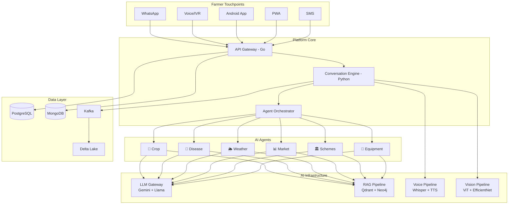

# 🌾 Aranya.ai — Technical Architecture

> **The world's most trusted AI-powered agricultural decision infrastructure for India**

---

## Architecture Documents

This repository contains the complete technical architecture for Aranya.ai, designed to scale from 100 to 100M+ Indian farmers.

### Document Index

| # | Document | Scope | Key Topics |
|---|----------|-------|------------|
| 1 | [Vision & Core Architecture](./01-vision-and-core-architecture.md) | Platform Foundation | Executive vision, product architecture, 6 user interfaces, 12+ microservices, database schemas, API design, service interactions |
| 2 | [AI & ML Architecture](./02-ai-and-ml-architecture.md) | Intelligence Layer | Foundation models, RAG pipeline, 7 specialized agents, farmer memory, village intelligence, disease diagnosis, voice pipeline, model serving |
| 3 | [Data, Infrastructure & DevOps](./03-data-infrastructure-devops.md) | Operations | Data lake, ETL/streaming pipelines, GCP cloud architecture, Kubernetes, CI/CD, MLOps, feature store, observability |
| 4 | [Security, Scalability & Roadmap](./04-security-scalability-roadmap.md) | Strategy | Security architecture, DPDPA compliance, scaling to 100K RPS, 4-phase roadmap, cost analysis, risk assessment, moat analysis |

---

## Architecture at a Glance

---

## Key Design Decisions

| Decision | Choice | Rationale |
|----------|--------|-----------|
| **Primary Cloud** | GCP (Mumbai + Delhi) | Best AI/ML ecosystem, GKE Autopilot, $200K startup credits |
| **Primary LLM** | Gemini 2.5 Flash → Self-hosted Llama 3.3 at scale | Best Indian language support, then cost optimization |
| **Architecture Pattern** | Modular monolith (V1) → Microservices (V2+) | Don't over-engineer early; extract when scale demands |
| **Primary Language** | Go (high-throughput) + Python (AI/ML) | Each language where it excels |
| **Database Strategy** | Polyglot persistence (7 databases) | Right tool for each data pattern |
| **Voice Strategy** | Whisper V3 (self-hosted) + Azure TTS | Best Indian language ASR + TTS quality |
| **Offline** | TFLite on-device + delta sync | Critical for rural India connectivity |
| **Compliance** | DPDPA 2023 first-class citizen | India data localization, consent management, right to erasure |

---

## Scale Trajectory

| Metric | V1 (3 mo) | V2 (9 mo) | V3 (18 mo) | V4 (36 mo) |
|--------|-----------|-----------|-----------|-----------|
| Users | 100 | 10K | 1M | 100M |
| Monthly Cost | $2K | $15K | $100K | $750K |
| Cost/Farmer/Month | $40 | $3 | $0.20 | $0.075 |
| Team Size | 4 | 12 | 30 | 100+ |
| Languages | 1 | 3 | 10+ | 22 |

---

## Competitive Moat

1. **Data Network Effects** — More farmers → better models → better recommendations → more farmers
2. **Village Intelligence** — Proprietary local knowledge that no competitor can replicate
3. **Farmer Memory** — Historical context that gets more valuable over time
4. **Trust** — Built through accurate recommendations and outcome tracking
5. **Distribution** — WhatsApp + Voice = zero-friction adoption for any literacy level
6. **Government Integration** — Scheme switching costs create lock-in

---

*Built for the next decade of Indian agriculture.*
